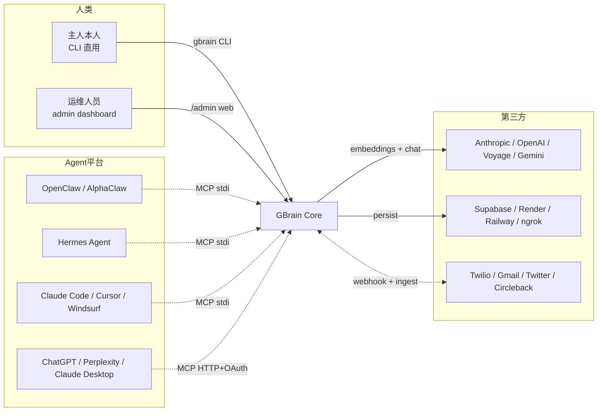

# GBrain 业务与用户视角分析

> 一句话定位：**给 AI Agent 装一颗会复利的大脑**——Garry Tan（YC 总裁）跑自己 OpenClaw / Hermes Agent 的生产基建，开源出来给所有 Agent 用。
> 核心叙事：Agent 很聪明但健忘；GBrain 让它每天都比昨天聪明。

---

## A. 业务用例图 / 业务能力蓝图

### A.1 系统边界

**gbrain 管什么** ✅
- 持久化知识存储（Postgres + pgvector 或 PGLite 嵌入式）
- 混合检索（向量 + 关键词 + RRF 融合 + 多查询扩展）
- 自动连线的实体知识图谱（人/公司/概念/事件 + typed links）
- 摄入管道（会议、邮件、推文、链接、语音、PDF、GitHub）
- 周期性脑维护（dream cycle、entity enrich、citation 修复）
- Skill 包分发（34 个 fat markdown 程序）
- MCP 服务器（stdio / HTTP + OAuth 2.1）+ admin dashboard
- 自我评估（BrainBench、LongMemEval、session capture）
- 后台 Job 队列（Minions：deterministic 工作走 job 不走 sub-agent）

**gbrain 不管什么** ⛔
- 不当 Agent 本体（Agent 由 OpenClaw / Hermes / Claude Code 提供）
- 不写应用代码（GStack 是写代码的 mod，GBrain 是"除写代码外的一切"）（参见 CLAUDE.md:7-8）
- 不做模型推理（调用 OpenAI / Anthropic / Voyage 等外部模型）
- 不做云协作（v0 是单用户；多用户走 Supabase RLS，是未来项）
- 不替你判断（"deterministic → Minions，判断 → sub-agents"，由 Agent 自己决定）（参见 README.md:269-272）

### A.2 核心业务能力（7 项）

| # | 能力 | 入口 | 性质 |
|---|---|---|---|
| 1 | **持久存储 + 版本** | `put_page` / `pages` 表 + `page_versions` | 确定性 |
| 2 | **混合检索** | `gbrain query` / `searchVector` + `searchKeyword` + RRF | 确定性 |
| 3 | **自连线知识图谱** | 每次写页面零 LLM 调用提取实体 + typed link | 确定性 |
| 4 | **摄入 / 富化** | `signal-detector` + `ingest` + `enrich` skills | 判断性（latent） |
| 5 | **脑维护循环** | `maintain` + `dream-cycle` cron | 判断性（夜间） |
| 6 | **Skill 分发** | 34 个 markdown recipe + `RESOLVER.md` 路由 | 判断性 |
| 7 | **Agent 通道** | MCP stdio + HTTP + OAuth + admin UI + 30+ tools | 确定性 |

### A.3 外部参与者



参见 README.md:25-126、openclaw.plugin.json:24-32。

---

## B. 用户旅程地图

### B.1 目标用户画像（具体三类）

| 画像 | 描述 | 占比推断 |
|---|---|---|
| **P1 · YC 圈层 Agent 重度用户** | YC 投资人 / 创始人，已跑 OpenClaw 或 Hermes，每天处理大量会议+邮件+推文 | 主战场 |
| **P2 · 独立开发者 / Agent 极客** | 自己装 Claude Code + MCP，想给 Agent 加长期记忆 | 流量入口 |
| **P3 · 用 GStack 的工程 Agent** | 已经在用 Garry 另一个项目 GStack 写代码，需要 code lookup 而非 grep | 协同获客 |

**不是目标用户**：要"chat with your notes"的 C 端用户（"Not a note-taking app"——GBRAIN_V0.md:6）。

### B.2 主流程 —— 从 "Agent 健忘" 到 "Agent 拥有大脑"

| 阶段 | 触点 | 痛点 | 情绪 |
|---|---|---|---|
| **0. 觉知** | Twitter 看到 Garry "100x productivity / thin harness fat skills" 推文 | "我的 Agent 每天都在忘记同样的事" | 焦虑 → 好奇 |
| **1. 进场** | 粘贴一句话进 OpenClaw：`Retrieve and follow https://.../INSTALL_FOR_AGENTS.md` | 通常装 Agent 基建要 1 天，配 API key 配到崩 | 怀疑 → 试试看 |
| **2. 安装** | Agent 自己跑 9 步 INSTALL_FOR_AGENTS（clone + bun install + init + 装 34 skills + 配 cron） | "我连 bun 是什么都不知道" → 但 Agent 帮我搞定了 | 紧张 → 惊喜 |
| **3. 首次导入** | `gbrain import ~/notes/` PGLite 2 秒就绪，markdown 全部入库 | 之前 Obsidian / Notion 数据搬不动 | 释然 |
| **4. 第一次见效** | "Prep me for my meeting with Jordan in 30 minutes" → Agent 自动拉出档案、共同历史、未结线索 | "天，它真的记得 Jordan 是谁" | ⭐ Wow moment |
| **5. 复利启动** | signal-detector 每条消息都在后台抓实体；cron 夜间跑 dream cycle | "我睡觉它在变聪明" | 上瘾 |
| **6. 个性化** | 跑 soul-audit 生成 SOUL.md / USER.md / ACCESS_POLICY.md / HEARTBEAT.md | Agent 终于"知道我是谁" | 归属感 |
| **7. 扩展** | 接入 voice / email / calendar / X integrations | 信号源全部进脑 | 主人感 |
| **8. 信任** | 半年后 17,888 pages / 4,383 people / 723 companies；BrainBench P@5 49.1% / R@5 97.9% | 数字说话，不再凭感觉 | 依赖 |

参见 README.md:5、README.md:9、README.md:243-247、INSTALL_FOR_AGENTS.md:1-149。

### B.3 关键 Wow moment

1. **30 分钟从零到能用**——README.md:15
2. **"Agent 自己装"**——主人粘贴一行 URL，Agent 自己 clone、装依赖、配 cron（INSTALL_FOR_AGENTS.md:1-3）
3. **复利反馈**——`gbrain doctor` 显示 "intent classifier: 87% deterministic, up from 40% in week 1"（README.md:240）
4. **越睡越聪明**——21 个 cron job 夜间跑（README.md:5）

---

## C. 服务蓝图（Service Blueprint）

### C.1 四层

```
┌─────────────────────────────────────────────────────────────────┐
│ 前台（用户/Agent 感知）                                          │
│  - CLI:  gbrain init / import / query / serve / doctor / ...    │
│  - MCP:  stdio 30+ tools  |  HTTP + OAuth 2.1 (7 admin screens) │
│  - Admin Dashboard (React, ~65KB gzip, 内嵌二进制)                │
└──────────────────────────┬──────────────────────────────────────┘
                           │
┌──────────────────────────▼──────────────────────────────────────┐
│ 后台处理层（Fat Skills + Thin Harness + 47 ops）                 │
│  - 34 Skills (signal-detector / brain-ops / ingest / enrich /   │
│               query / maintain / minion-orchestrator / ...)     │
│  - Core 引擎: BrainEngine 抽象 + Postgres/PGLite 双实现           │
│  - Hybrid Search: vector + keyword + RRF + multi-query expand   │
│  - Auto-link: 零 LLM 调用的 typed-link 提取                       │
│  - Minions Job Queue (Postgres-native, durable)                 │
│  - Dream Cycle: 夜间 entity sweep / citation fix / consolidate  │
└──────────────────────────┬──────────────────────────────────────┘
                           │
┌──────────────────────────▼──────────────────────────────────────┐
│ 支撑系统（外部依赖）                                              │
│  - Embedding: OpenAI / Voyage / Gemini / Azure / 14 recipes     │
│  - Chat LLM: Anthropic Opus/Sonnet/Haiku / OpenAI / Gemini      │
│  - DB: Supabase (managed Postgres+pgvector) | PGLite (本地 WASM) │
│  - Schedulers: OpenClaw cron / Railway cron / crontab           │
│  - 第三方 sense: Twilio / Gmail / Calendar / Twitter / Slack    │
└──────────────────────────┬──────────────────────────────────────┘
                           │
┌──────────────────────────▼──────────────────────────────────────┐
│ 物理证据（用户可见的"脑确实在运转"）                              │
│  - Brain pages (markdown, compiled_truth + timeline)             │
│  - ~/.gbrain/audit/*.jsonl (supervisor / sync-failures)         │
│  - gbrain stats / gbrain doctor / gbrain integrations stats     │
│  - Admin UI 活动 SSE feed                                        │
│  - 17,888 pages / 4,383 people 这种数字回报                       │
└─────────────────────────────────────────────────────────────────┘
```

参见 README.md:82-141、README.md:226-247、GBRAIN_V0.md:478-491。

### C.2 协作关系要点

- **前台 ↔ 后台分离**：CLI 和 MCP 都是 `src/core/operations.ts` 47 个共享 op 的薄包装（CLAUDE.md:30），契约优先
- **后台 ↔ 支撑分离**：embedding/LLM 通过 `src/core/ai/gateway.ts` 统一 seam（CLAUDE.md:96），换 provider 不动业务逻辑
- **trust boundary**：本地 CLI (`remote=false`) vs Agent 调用 (`remote=true`)，敏感操作如 `file_upload` / `submit_job` 失败默认 closed（CLAUDE.md:35-39、AGENTS.md:29-35）

---

## D. 价值主张画布 / 商业模式画布

### D.1 价值主张

| 维度 | 内容 |
|---|---|
| **痛点** | Agent 每次会话清零、跨会话不记得人事物、检索质量差（纯向量搜不出"who works at Acme AI"）、自己造记忆基建要踩半年坑 |
| **缓解** | 一行命令装好；摄入到答案 30 分钟可用；自连线知识图谱省去手动标注 |
| **增益** | 复利效应——每天比昨天聪明；BrainBench P@5 49.1% 公开打分；YC 总裁亲自跑的生产配置 |
| **不可替代** | "thin harness, fat skills" 哲学下 markdown 即代码，模型升级自动获得能力升级（参见 docs/ethos/THIN_HARNESS_FAT_SKILLS.md:177） |

### D.2 商业模式画布

| 模块 | 内容 |
|---|---|
| **客户细分** | P1 YC 内部 Agent 用户 / P2 独立 Agent 极客 / P3 GStack 工程 Agent 用户 |
| **渠道** | GitHub repo（首发主渠道）+ Garry 个人 Twitter（@garrytan）+ YC Spring 2026 talk + INSTALL_FOR_AGENTS.md "粘贴一行 URL" 病毒式 |
| **客户关系** | 纯开源社区，Issue 驱动（issue #218 / #658 / #500 等都在 README 公开），AGENTS.md 显式邀请 fork |
| **收入来源** | **当前无直接货币化**（MIT/Apache 类开源）。间接价值：① YC 总裁个人品牌 + 招生招牌；② OpenClaw / Hermes 生态绑定（参见 openclaw.plugin.json:80-89）；③ GStack 协同——同一作者两个 mod 互引（README.md:127-141） |
| **关键活动** | 每日提交 + 每周一次小版本（README 里 v0.25 / v0.28 / v0.31 / v0.32 节奏） + 跑自己的真实工作流（dogfood："Built by the President and CEO of Y Combinator to run his actual AI agents"——README.md:5） |
| **关键资源** | Garry 本人的真实 17K+ 页生产 brain + YC 影响力 + Claude Code 源码泄漏后的洞察（参见 THIN_HARNESS_FAT_SKILLS.md:23-24） |
| **关键合作** | Anthropic / OpenAI / Supabase / 各 embedding provider；OpenClaw / Hermes / Claude Code 三大 Agent 平台 |
| **成本结构** | 主要是 Garry 本人时间投入（"built in 12 days"——README.md:5）+ 自己跑的 Supabase Pro $25/mo + LLM 调用 |

**关键判断**：GBrain 当前是 **Garry 个人影响力 × YC 战略基建** 的载体，**不追求自身现金流**。这点对主人的"开源 vs 商业化"决策至关重要。

---

## E. ⭐ Garry 的设计哲学

这一节最重要。从两份 ethos 文档 + AGENTS.md + README.md 反复读出 6 条核心信条。

### E.1 Thin Harness, Fat Skills（瘦壳厚技）

**定义**：harness 是运行模型的程序，只做四件事——跑模型循环、读写文件、管 context、保安全；约 200 行。Skills 是 fat markdown 程序，编码 90% 价值的判断和流程。
**反模式**：40+ tool 定义吃掉一半 context window、God tools 2-5 秒 MCP 往返、REST 包装器把每个 endpoint 都做成 tool。
**正模式**：Playwright CLI 一次操作 100ms vs Chrome MCP 15 秒，**75 倍速度差**。
**解读**：用最薄的运行时执行最厚的判断逻辑——"软件不必再金贵了，按需精确构建"。
**出处**：docs/ethos/THIN_HARNESS_FAT_SKILLS.md:49-54、docs/ethos/THIN_HARNESS_FAT_SKILLS.md:82-92

### E.2 Markdown 即代码（Skill File 是方法调用）

**定义**：skill 文件不是文档、不是 prompt——它是一种带参数的方法调用。同一个 `/investigate` skill，参数指向"医学研究 + 210 万份 discovery email"或"FEC 申报 + 影子公司"，**同样 7 步流程**产出截然不同的能力。
**升级洞察**：markdown 同时是 ① 给人读的文档 ② 给 Agent 实现的规范 ③ 分发用的包 ④ 能力的源代码——四件套压缩成一份文件。`brew install` 给你别人的二进制；`gbrain install voice-agent` 给你 Agent 现场实现的自家版本。
**解读**：当模型能从英文规范实现的能力突破后，软件分发的本体不再是代码，而是英文写的"配方"。
**出处**：docs/ethos/THIN_HARNESS_FAT_SKILLS.md:34-46、docs/ethos/MARKDOWN_SKILLS_AS_RECIPES.md:62-78、docs/ethos/MARKDOWN_SKILLS_AS_RECIPES.md:152-162

### E.3 Brain-first Lookup（外脑优先于外网）

**定义**：每次响应前先查脑、再调外部 API——`brain-ops` skill 强制这一点。
**为什么**：① 你脑里的信息更准；② 复利只在闭环（读-富化-写）里发生；③ "the brain doesn't have info on X" 比幻觉好。
**信条原文**："Search YOUR thinking, not the internet"（README.md:246）。
**出处**：README.md:152-156、INSTALL_FOR_AGENTS.md:103-110

### E.4 Self-wiring（自连线）

**定义**：每次 `put_page` 写入，**零 LLM 调用**就提取实体引用并创建 typed links（attended、works_at、invested_in、founded、advises）。混合搜索 + backlink-boost ranking 让"who works at Acme AI?"这种结构化问题有答案。
**为什么不用 LLM**：① 成本（每次写都调 LLM 不可持续）；② 确定性（regex/parser 100% 一致）；③ 速度（毫秒级 vs 秒级）。
**深层原则**：判断（latent）和确定（deterministic）分清——"LLM 能给 8 人排座位，让它排 800 人就会幻觉"。
**出处**：README.md:5-7、docs/ethos/THIN_HARNESS_FAT_SKILLS.md:66-74

### E.5 Compounds Daily（每日复利）

**定义**：每条信号到达 → signal-detector 后台抓 → brain-ops 先查脑 → 全 context 响应 → 写回带 citation → auto-link → 下次更聪明。**"build it once. it runs forever."**
**实证**：21 cron jobs 自治运行；deterministic 分类器有 fail-improve loop，从 40% → 87% 一周内自动改善。
**反面**：one-off 工作是失败——"如果同一件事我要问你两次，你就失败了"。第一次手工做 3-10 个 → 出成果 → 编码为 skill → 上 cron。
**出处**：README.md:226-247、docs/ethos/THIN_HARNESS_FAT_SKILLS.md:169-179

### E.6 Latent vs Deterministic（判断与确定的二元论）

**定义**：系统每一步都属于其一。latent 是智能（读、判、合）；deterministic 是信任（同入同出）。把对的工作放对的边。
**应用**：摄入 = skill（latent，要判断"SAYS vs ACTUALLY BUILDING"）；list/status = code（deterministic）。Minions 跑 deterministic 后台 job，sub-agent 跑判断性任务。
**裁判表**：参见 docs/ethos/THIN_HARNESS_FAT_SKILLS.md:189-210 的 "Skill or Code?" 决策表。
**出处**：docs/ethos/THIN_HARNESS_FAT_SKILLS.md:66-74、README.md:268-272

---

## F. ⭐⭐ 对主人新方向（Agent 记忆与自进化）的启示

主人项目的题目是"Agent 记忆与自进化引擎"，与 GBrain 高度重合。下面 6 条可直接拿走的设计原则：

### F.1 ✅ 模块边界 —— 按"信号-存储-检索-维护"四层切，而非按 skill 切

**Garry 的做法**：按 skill 文件（34 个 skill，每个一份 SKILL.md）作为分发单位，但**内部架构**仍是清晰的四层（前台/后台/支撑/物理证据）。
**建议**：主人项目内部模块按"摄入→存储→检索→脑维护→Agent 通道"五层切；skill 是**对外分发**单位，不是**内部架构**单位。混淆会导致一个 skill 跨多层修改时改得到处都是。

### F.2 ✅ 借鉴 Brain-first + Self-wiring + Compounds 三件套

这三条几乎是 Agent 记忆系统的**最大公约数**——任何长期记忆方向都绕不开：
- **Brain-first**：每次响应先查脑——这是闭环复利的起点
- **Self-wiring 零 LLM**：写入即抽取实体+连线，不能依赖 LLM 否则规模化崩
- **Compounds**：dream cycle 这种夜间巩固机制必须有，否则只是"存储"不是"进化"

### F.3 ⚠️ "Markdown 即代码" 哲学要谨慎评估

**Garry 的赌注**：模型已经强到能从英文规范实现能力，所以 skill 文件就是源码。
**风险**：① 主人场景如果是给非 Claude / 非 Opus 的较弱模型用，这条不成立——MARKDOWN_SKILLS_AS_RECIPES.md:80-103 自己承认 "GPT-3 couldn't do this, GPT-4 sort of, Opus 4.6 well"；② 中文场景下 markdown 是否有同等表达力存疑（gbrain 自己有 CJK wave v0.32.7 处理中文，但仍按 char 切分）；③ 调试性差——同一个 skill 在 Opus 和 Sonnet 下行为不同时，没有传统编译器报错。
**建议**：主人项目若面向多模型，**保留 skill 作为高层 DSL，但关键路径补一份确定性 fallback**（即 Garry 的 "Skill or Code" 决策表的极端化版本——边界更偏 code 一侧）。

### F.4 🔴 商业模式不能盲目复制纯开源

**Garry 能纯开源是因为**：① 他本人收入来自 YC 总裁岗位，gbrain 是个人品牌+YC 招牌；② OpenClaw / Hermes 生态绑定锁定使用面；③ 他**已经有**真实生产数据（17K pages）作为信任证据。
**主人不具备这些**。如果主人项目走纯开源，需要明确替代变现路径：
- 卖企业版（多用户 / RLS / 私有部署 + 支持）？
- 卖配套硬件（前面"算力资源"项目可能联动）？
- SaaS 托管版（Supabase 提供的脑作为服务）？
- 走"知识库 + Agent 撮合"路线（与主人"知识库"项目协同）？

**强烈建议**：从孵化期就想清楚商业模式，不要"先开源再说"。

### F.5 ✅ 借鉴：契约优先 + 双 Engine 抽象 + Trust Boundary

这是 gbrain 在工程上做得最干净的三点：
- `src/core/operations.ts` 47 个 op 是 CLI / MCP / HTTP 三个前台的**单一真源**（CLAUDE.md:30）
- `BrainEngine` 抽象 + Postgres / PGLite 双实现，本地零配置/云端规模化两条路（CLAUDE.md:42-45）
- `OperationContext.remote` 把"本地 CLI 信任 vs Agent 远程不可信"的安全语义编译期固化（CLAUDE.md:43）

**主人项目从一开始就要这么做**——尤其是 trust boundary，事后补极痛。

### F.6 ✅ 借鉴评估文化 —— BrainBench-Real / LongMemEval 双轨

**Garry 做了什么**：① 自己造 BrainBench（开源 sibling repo gbrain-evals）公开打分；② 内嵌 LongMemEval 跑公开数据集；③ 提供 session capture，让贡献者用真实捕获的 query 做 PR 回归测试（默认关闭，contributor mode 才开）。
**为什么这是杀手锏**：Agent 记忆系统最大的问题是"看起来好但不知道好多少"。Garry 用三层评估解决：① 公开数据集（横向可比）；② 自造 benchmark（纵向追踪）；③ 真实流量回放（贴近生产）。
**主人项目建议**：从 V0 就内建评估骨架，**不要等到产品成熟才补评估**——参见 docs/eval-bench.md 的方法论。

---

## 关键发现 Summary

1. **GBrain 本质是 Garry 个人生产配置的开源化**——所有数字（17,888 pages / 21 cron / BrainBench P@5 49.1%）都来自他**本人真实使用**，这是它的护城河（他人复制不了"真实跑过"），也是主人项目最难复制的部分
2. **"Thin Harness, Fat Skills" 是 Garry 押注模型智能向上跑的一张牌**——成立于 Opus 级模型能从英文规范实现复杂能力；这条赌注对主人场景需要单独验证
3. **GBrain 不是孤立项目，它和 GStack（写代码）+ OpenClaw（Agent 平台）形成铁三角**——单独看 GBrain 的商业模式会误判，必须把 Garry 的整个生态作为整体研判（openclaw.plugin.json + README.md:127-141）

