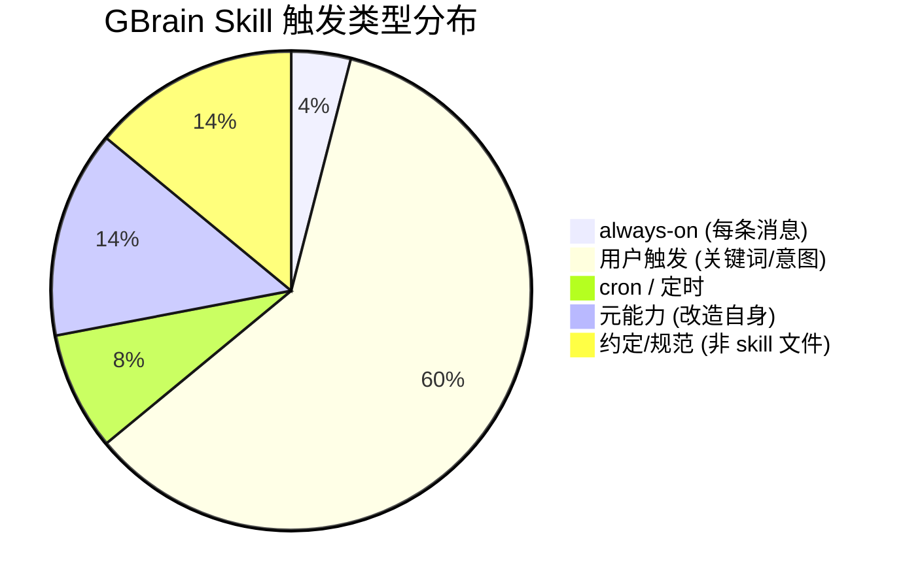
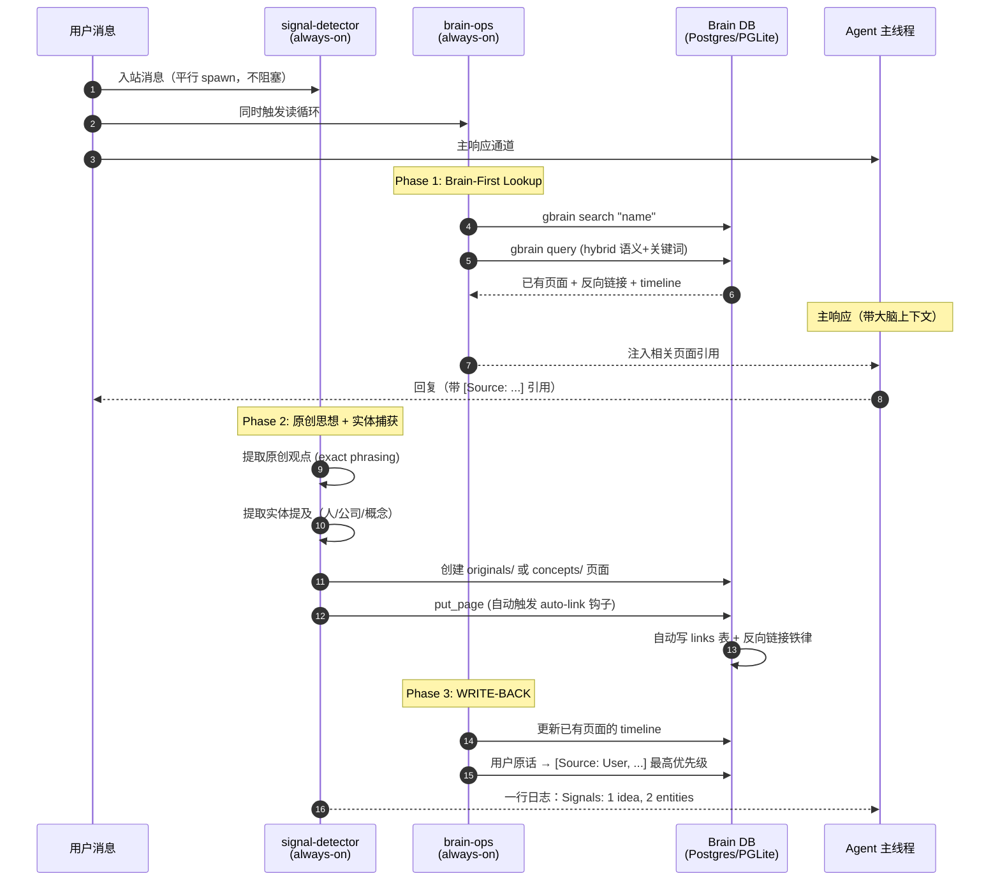
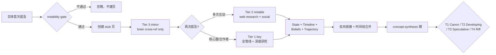
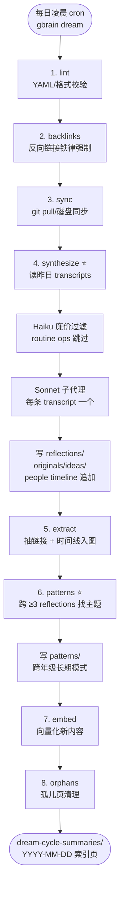
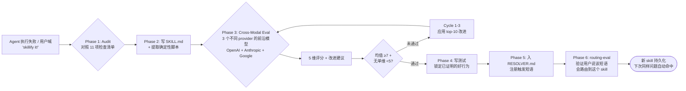

# GBrain 功能与流程视角

> 本文从「做什么」视角剖析 GBrain。50 个 skill 不是平铺的工具集合，而是一台**「环境信号 → 大脑写入 → 自进化巩固」的活体机器**。本视角拆出它的功能域、主循环、用例和对主人新项目（Agent 记忆与自进化）的启示。

---

## A. 功能模块架构图（按功能域重分组）

50 个 skill 按 GBrain 自己的 RESOLVER.md 是按"触发场景"分的（参见 `skills/RESOLVER.md`）；这里按**功能本质**重切，分成 8 大功能域 + 4 类元属性标记。

### A.1 八大功能域树

```
GBrain Skillpack
│
├── 1. 信号层（always-on，每条消息触发）
│   ├── signal-detector          [always-on, LLM] 双线捕获：原创思想 + 实体提及
│   └── brain-ops                [always-on, LLM] 读→丰富→写循环 + 反向链接铁律
│
├── 2. 输入路由层（按内容类型分流）
│   ├── ingest                   [router]         总路由器，按内容类型派发
│   ├── idea-ingest              [trigger, LLM]   链接/文章/推文 + 作者画像
│   ├── media-ingest             [trigger, LLM]   视频/音频/PDF/书/截图/repo
│   ├── meeting-ingestion        [trigger, LLM]   会议纪要 + 与会人 enrich
│   ├── voice-note-ingest        [trigger, LLM]   语音备忘录（**原话保真**）
│   ├── webhook-transforms       [trigger]        外部事件 → 大脑信号
│   └── archive-crawler          [trigger, LLM]   扫描 Dropbox/Gmail 老归档
│
├── 3. 丰富与画像层（人/公司/概念长出血肉）
│   ├── enrich                   [trigger, LLM]   Tier 1/2/3 分级，人/公司画像
│   ├── article-enrichment       [trigger, LLM]   原始文本块 → 结构化页面
│   ├── perplexity-research      [trigger, LLM]   Web 研究，对照大脑找"新"
│   ├── data-research            [trigger, LLM]   结构化追踪（投资人/捐赠/指标）
│   └── academic-verify          [trigger, LLM]   学术引用验证
│
├── 4. 查询与图谱层（读出来）
│   ├── query                    [trigger, LLM]   3 层搜索 + 引用传播
│   └── （graph-query 内嵌在 query 中，走 typed-link 图）
│
├── 5. 维护与自进化层（让大脑越用越聪明）
│   ├── maintain                 [maintain, LLM]  健康检查 + 8 阶段 dream cycle
│   ├── concept-synthesis        [maintain, LLM]  概念去重 → T1/T2/T3/T4 智识地图
│   ├── citation-fixer           [maintain]       引用格式审计
│   ├── frontmatter-guard        [maintain]       YAML 头部校验
│   └── cron-scheduler           [maintain]       调度/静默时段/分散调度
│
├── 6. 输出与发布层
│   ├── briefing                 [trigger, LLM]   每日简报
│   ├── daily-task-prep          [trigger, LLM]   晨间准备（日程 + 上下文）
│   ├── daily-task-manager       [trigger]        任务生命周期
│   ├── reports                  [trigger]        时间戳报告存取
│   ├── publish                  [trigger]        分享为加密 HTML（零 LLM）
│   ├── brain-pdf                [trigger]        生成出版级 PDF
│   ├── book-mirror              [trigger, LLM]   书 → 个性化双栏分析（旗舰）
│   └── strategic-reading        [trigger, LLM]   以问题为透镜读书
│
├── 7. 协作与子代理层
│   ├── minion-orchestrator      [trigger]        Postgres-native 任务队列
│   ├── ask-user                 [trigger]        choice-gate 人机决策点
│   └── cross-modal-review       [trigger, LLM]   跨模型二次审稿
│
├── 8. 元能力层（让 Agent 改造自己）
│   ├── skillify                 [meta, LLM]      把任意原始功能升级为合规 skill
│   ├── skill-creator            [meta, LLM]      按规范创建新 skill
│   ├── functional-area-resolver [meta]           压缩 RESOLVER.md 路由表
│   ├── testing                  [meta]           skill 验证框架
│   ├── skillpack-check          [meta]           大脑健康 JSON 报告
│   ├── smoke-test               [meta]           重启后自检 + 自愈
│   └── soul-audit               [meta, LLM]      6 阶段访谈生成 SOUL/USER/HEARTBEAT
│
└── 9. 安装与运维层（边角）
    ├── setup                    [setup]          首装（Supabase/PGLite 自配）
    ├── migrate                  [setup]          Obsidian/Notion/Logseq 迁移
    ├── cold-start               [setup, LLM]     空仓引导 + 数据导入排序
    ├── repo-architecture        [convention]     归档目录规范
    └── _conventions/*           [convention]     横切规范（quality/brain-first/routing 等）
```

### A.2 触发类型分布（50 个 skill 全维度）



| 标记 | 含义 | 数量 |
|---|---|---|
| always-on | 每条入站消息无条件触发 | 2 |
| trigger | 用户特定意图 / 关键词触发 | 30 |
| cron | 定时（如 dream cycle，凌晨 2 点） | 4 (maintain 内多个 phase) |
| meta | 改造 skill 系统本身的 skill | 7 |
| convention | 横切规范文件（filing / quality / routing） | 7 |

（参见 `skills/manifest.json` + `skills/RESOLVER.md`；总 skill 目录 45 个 + 5 个规范文件 = 50）

---

## B. 业务流程图（核心主循环）

### B.1 主循环：每条消息的完整生命周期

参见 `skills/signal-detector/SKILL.md:23-90` + `skills/brain-ops/SKILL.md:55-95`。



**关键点（参见 `skills/_brain-filing-rules.md:63-75`）：**
- **Iron Law 反向链接**：每提到一个有页面的实体，对方页面必须回链
- **Auto-link 钩子**：v0.10.1+ 起，`put_page` 自动从正文抽取实体写入图谱 `links` 表
- **来源优先级**：用户直述 > compiled_truth > timeline > 外部 API

---

### B.2 自进化循环：Tier 升级（提及计数驱动）

参见 `skills/enrich/SKILL.md:78-86`。



**机制亮点：**
- **不上来就全量丰富**：低价值实体仅留 stub，避免 API 浪费
- **提及频次自动升级 Tier**：跨多次互动后系统识别为关键人物 → 升级到 Tier 1 全量画像
- **concept-synthesis 二次淬炼**：N 个 stub 概念 → ~N/4 canonical 概念，再按使用频次/时间跨度分 T1-T4

---

### B.3 Dream Cycle：凌晨自动巩固（核心自进化）

参见 `skills/maintain/SKILL.md:88-161`。



**关键设计（强烈值得借鉴）：**
- **两层过滤降本**：先 Haiku 廉价判断"这段对话值不值得处理"，再 Sonnet 深度合成
- **冷却机制**：`cooldown_hours: 12`，autopilot 下每天最多 2 次合成跑
- **隐私正则**：`exclude_patterns: ["medical", "therapy"]` 自动跳过敏感语料
- **沙箱写入**：`allowed_slug_prefixes` allow-list 强制，即使 prompt injection 也不能逃逸
- **幂等键**：`(file_path, content_hash)` 双键，编辑后转录会生成新 slug 而非覆盖
- **Patterns 是最高杠杆**：单条 reflection 价值有限，跨 25 年纵向模式才是真智能（参见 `skills/maintain/SKILL.md:108-110`）

---

### B.4 Skillify Loop：失败 → 持久化修复（元能力循环）

参见 `skills/skillify/SKILL.md:42-180`。



**Skillify 的精神**：
- 一次失败 = 一次系统缺陷 = 一个新 skill 的机会
- **测试在 eval 之后写**：先证明质量，再用测试锁住——避免"测试锁住 mediocrity"
- 三个不同厂商的前沿模型必选，避免单一家族的盲点相关

---

## C. 用例规约 / 用户故事

### Story 1 ｜ 会议前 30 分钟自动准备

- **As a** 投资人/老板
- **I want to** 说"prep me for my meeting with Jordan in 30 minutes"
- **so that** 我进会议室前掌握 Jordan 的所有上下文（最近动态、过往承诺、共同朋友、未决问题）

**前置：** Jordan 已有 `people/jordan` 页面（Tier 1 或 2）
**链路：** `daily-task-prep` → `query` (3 层搜索) → `brain-ops` (timeline + backlinks) → 输出
**异常流：** Jordan 无页面 → `enrich` 触发 Tier 3 紧急画像
**后置：** 会议结束后会议纪要进入 → `meeting-ingestion` → 自动 enrich 所有参与者

---

### Story 2 ｜ 跨笔记主题自动浮现

- **As a** 创作者/研究者
- **I want to** 问"what themes show up across my notes?"
- **so that** 我发现自己持续在想什么——可能我都没意识到的智识 obsession

**前置：** 至少 30 天 + 多次对话已捕获 reflections
**链路：** `maintain` dream cycle 的 patterns phase（自动）+ 用户主动用 `concept-synthesis`
**异常流：** 不足 3 个 reflection 支撑某主题 → 不生成 pattern 页（min_evidence: 3 防噪音）
**后置：** 写出 `wiki/personal/patterns/<theme>` 页，跨 25 年纵向模式

---

### Story 3 ｜ 失败一次，永久修复（skillify it!）

- **As a** Agent 主人
- **I want to** 在 Agent 处理 X 类问题失败后说"skillify it!"
- **so that** 同样的失败下次永远不再发生

**链路：** `skillify` → `skill-creator` → `cross-modal-review` → `testing` → `routing-eval`
**异常流：** Cycle 3 后仍不通过 → 写 KNOWN_GAPS section 标注限制，不阻塞发布
**关键价值：** 把"一次成功的临时手艺"凝固为"永远可路由的能力"

---

### Story 4 ｜ 凌晨自动巩固昨日对话

- **As a** 用户
- **I want to** 睡觉时大脑自己处理昨天所有对话
- **so that** 早上醒来大脑比昨晚更聪明

**触发：** cron `0 2 * * * gbrain dream --json`
**链路：** `maintain` 8 阶段 dream cycle（synthesize → patterns）
**异常流：** 12 小时冷却内重复触发 → 静默跳过；触发 `--input` 显式输入 → 绕过冷却
**后置：** 用户晨间打开看到 `dream-cycle-summaries/2026-05-12` 索引

---

### Story 5 ｜ 加载一个 cron job

- **As a** 用户
- **I want to** 说"每周一早 8 点给我做投资人周报"
- **so that** 不必自己记起触发

**链路：** `cron-scheduler` 注册 → 静默时段避让（quiet hours）→ `reports` 输出
**异常流：** 与其他 cron 时间冲突 → 自动 staggering 分散

---

### Story 6 ｜ 拍一张白板照片入脑

- **As a** 用户在外面
- **I want to** 发一张白板/截图
- **so that** 内容自动提取实体并入脑

**链路：** `media-ingest` (screenshot 分支) → OCR → entity extraction → `enrich`/`brain-ops` 写回
**异常流：** 截图太糊 OCR 失败 → 提示重拍

---

### Story 7 ｜ 把一本书变成"专属于我"的版本

- **As a** 主人
- **I want to** 说"mirror this book to my life"
- **so that** 书的每一章右栏都映射到我自己的人/事/项目

**链路：** `book-mirror` CLI → fan-out N 个只读子代理（每章一个）→ assemble → 单次 `put_page` 写回
**关键设计：** 子代理 `allowed_tools: ['get_page', 'search']` 不能 put_page，untrusted EPUB 内容无法 prompt-inject 任何人物页面
**输出：** `media/books/<slug>-personalized.md` + 可选 PDF

---

### Story 8 ｜ 非主人发消息时拒绝响应

- **As a** Agent 主人
- **I want to** 别人加我 Telegram 时 Agent 不该听话
- **so that** 大脑安全 + 身份一致

**链路：** signal-detector → 检查 `ACCESS_POLICY.md`（soul-audit 生成）→ 非 owner → 拒绝路由
**前置：** `soul-audit` 6 阶段访谈完成，已生成 SOUL/USER/ACCESS_POLICY/HEARTBEAT

---

### Story 9 ｜ 一段失败错误自动归档为友善反馈

- **As a** GBrain 共建者
- **I want to** 命令执行不顺时直接喊 `gbrain friction log`
- **so that** 维护者拿到结构化反馈不用我写 bug 报告

**链路：** `_friction-protocol.md` → `gbrain friction log --severity {confused|error|blocker|nit}` → 自动填 ts/cwd/version
**后置：** 维护者 `gbrain friction render` 出 markdown 报告

---

## D. 50 个 Skills 完整索引（按功能域）

### D.1 信号层（always-on）

| Skill | 一句话职责 | 触发 | LLM | 关键依赖 |
|---|---|---|---|---|
| signal-detector | 每条消息双线捕获：原创思想 + 实体提及 | always-on | ✓ | brain-ops, enrich |
| brain-ops | 读→丰富→写循环，反向链接铁律 | always-on | ✓ | core/engine, links 表 |

### D.2 输入路由层（7 个）

| Skill | 一句话职责 | 触发 | LLM | 依赖 |
|---|---|---|---|---|
| ingest | 内容类型路由器，派发到下面专门 skill | 用户："ingest this" | - | 下面四个 |
| idea-ingest | 链接/文章/推文 + 必建作者画像 | URL/share/"save this" | ✓ | enrich, file_upload |
| media-ingest | 视频/音频/PDF/书/截图/repo 多模态 | "process this PDF/video" | ✓ | transcription, OCR |
| meeting-ingestion | 会议纪要 + 全员 enrich + 时间线合并 | meeting transcript | ✓ | enrich (每个与会人) |
| voice-note-ingest | 语音备忘录，**原话保真**决策树 | "voice note" | ✓ | transcription, decision tree |
| webhook-transforms | 外部事件（SMS/社交 mention）→ 大脑信号 | webhook 入站 | - | event normalizer |
| archive-crawler | 扫描 Dropbox/Gmail 老归档，需 allow-list | "crawl my archive" | ✓ | gbrain.yml scan_paths |

### D.3 丰富与画像层（5 个）

| Skill | 一句话职责 | 触发 | LLM | 依赖 |
|---|---|---|---|---|
| enrich | Tier 1/2/3 分级画像，7 步丰富协议 | entity 提及 + 通过 notability | ✓ | brain search, web APIs |
| article-enrichment | 原始文本墙 → 结构化页（quote/insight/why-it-matters） | "enrich this article" | ✓ | brain-ops |
| perplexity-research | Web 研究，对照大脑找"new vs known" | "what's new about" | ✓ | Perplexity + Opus |
| data-research | 结构化追踪（投资人/捐赠/公司指标），YAML recipes | "track this" | ✓ | recipes/*.yaml |
| academic-verify | 学术引用 → publication → method → replication 链 | "verify this study" | ✓ | perplexity-research |

### D.4 查询与图谱层（1 个 + 1 内嵌）

| Skill | 一句话职责 | 触发 | LLM | 依赖 |
|---|---|---|---|---|
| query | 3 层搜索（FTS / hybrid / 图遍历）+ 引用传播 | "what do we know about" 等 | ✓ | search, graph-query, embeddings |
| (graph-query) | 内嵌：typed-link 多跳图查询 | "who works at X" | - | links 表 |

**3 层搜索机制（参见 `skills/query/SKILL.md:47-55`）：**
1. **关键词** `gbrain search` — FTS 精确匹配
2. **语义** `gbrain query` — hybrid 向量 + 关键词扩展
3. **结构** `gbrain list-pages` + `get_backlinks` + `traverse_graph`

### D.5 维护与自进化层（5 个，含 dream cycle）

| Skill | 一句话职责 | 触发 | LLM | 依赖 |
|---|---|---|---|---|
| maintain | 8 阶段 dream cycle + 健康检查总入口 | cron / "run dream" | ✓ (子阶段) | cycle.ts, autopilot |
| concept-synthesis | N 个 stub → ~N/4 canonical，T1-T4 智识地图 | "synthesize my concepts" | ✓ | Jaccard + 语义去重 |
| citation-fixer | 引用格式审计 | "check citations" | - | regex + lint |
| frontmatter-guard | YAML 头部校验/修复 | "validate frontmatter" | - | YAML parser |
| cron-scheduler | 调度 + 静默时段 + staggering | "schedule X" | - | cron lib |

### D.6 输出与发布层（8 个）

| Skill | 一句话职责 | 触发 | LLM | 依赖 |
|---|---|---|---|---|
| briefing | 每日简报（会议 + 活跃 deal + 引用追踪） | "daily briefing" | ✓ | query, calendar |
| daily-task-prep | 晨间准备（日程 lookahead + 上下文加载） | 早间 cron / "prep my day" | ✓ | query, calendar |
| daily-task-manager | 任务生命周期（add/complete/defer/review） | "add task" 等 | - | tasks 表 |
| reports | 带时间戳的报告存取 + 关键词路由 | "save report" / "load report" | - | reports/ 目录 |
| publish | 大脑页面 → 密码保护 HTML（**零 LLM 调用**） | "share this page" | ✗ | static renderer |
| brain-pdf | 出版级 PDF 渲染 | "export as PDF" | ✗ | gstack make-pdf |
| book-mirror | 书 → 个性化双栏分析（章节摘要 ↔ 映射到你的生活） | "mirror this book" | ✓ | fan-out 只读子代理 |
| strategic-reading | 以特定问题为透镜读书 → 可执行 playbook | "apply this to my problem" | ✓ | query (problem context) |

### D.7 协作与子代理层（3 个）

| Skill | 一句话职责 | 触发 | LLM | 依赖 |
|---|---|---|---|---|
| minion-orchestrator | Postgres-native 任务队列，shell + LLM 双轨 | "background task" / "parallel" | (任务内) | Minions schema, Postgres |
| ask-user | choice-gate 决策门，2-4 选项阻塞 | 需用户拍板时 | - | platform adapter |
| cross-modal-review | 第二个模型给当前工作品质二审 | "second opinion" | ✓ | 多 provider |

### D.8 元能力层（7 个 —— ⭐ 主人最该看的）

| Skill | 一句话职责 | 触发 | LLM | 依赖 |
|---|---|---|---|---|
| skillify | 把原始功能升级为合规 skill（11 项检查清单 + 3 模型 eval） | "skillify it!" | ✓ | eval cross-modal |
| skill-creator | 按 conformance 标准创建新 skill | "create a skill" | ✓ | templates |
| functional-area-resolver | 压缩 RESOLVER.md：skill-per-row → 功能域 dispatcher | "RESOLVER too big" | - | 两层路由 |
| testing | skill 验证框架（frontmatter / sections / MECE） | "validate skills" | - | regex + schema |
| skillpack-check | 大脑健康 JSON 报告（cron-friendly） | morning cron / "is gbrain healthy" | - | doctor + migrations |
| smoke-test | 重启后自检 + 自愈 | post-restart | - | health checks |
| soul-audit | 6 阶段访谈生成 SOUL/USER/ACCESS_POLICY/HEARTBEAT | "who am I" / 首装 | ✓ | 交互式问答 |

### D.9 安装与运维层（5 个）

| Skill | 一句话职责 | 触发 | LLM | 依赖 |
|---|---|---|---|---|
| setup | 首装（Supabase/PGLite 自配，<2min TTHW） | "set up gbrain" | - | provisioner |
| migrate | Obsidian/Notion/Logseq/Roam 通用迁移 | "migrate from X" | - | parsers |
| cold-start | 空仓引导 + 数据源优先级排序 | "fill my brain" / "now what" | ✓ | ClawVisor 凭证 |
| repo-architecture | 大脑文件归档目录决策协议 | "where does this go" | - | filing rules |
| ask-user | （已在 D.7 列） | | | |

### D.10 横切约定文件（5 个，非 skill）

| 文件 | 作用 |
|---|---|
| `_brain-filing-rules.md` | 文件按"主题"归档；反向链接铁律；引用要求；dream-cycle 写路径白名单 |
| `_friction-protocol.md` | `gbrain friction log` 反馈协议 |
| `_output-rules.md` | 大脑页面无废话：链接确定性；无 LLM 套话；保真原话 |
| `conventions/quality.md` | 引用 + 反向链接 + 来源优先级 |
| `conventions/brain-first.md` | 5 步 brain-first 查询协议 |
| `conventions/brain-routing.md` | 跨大脑联邦（latent-space-only） |
| `conventions/subagent-routing.md` | Minions vs inline 路由决策 |

---

## E. 对主人新方向（Agent 记忆与自进化）的启示 ⭐⭐

### E.1 主人 Agent 应该划分多少 skill / 模块？

**奴婢建议：起步 10-15 个，分 4 层。** 不要照搬 50 个——GBrain 50 个是 garrytan 个人版图 10 年长出来的，主人现阶段没必要全量。

**最小可工作核心（必须有）：**

| 层 | 必备 skill | 类比 GBrain |
|---|---|---|
| 信号层 | 1 个 always-on 捕获 | signal-detector |
| 读循环 | 1 个 brain-first 查询 | brain-ops + query 合并 |
| 写循环 | 1 个 ingest（含路由） | ingest + enrich 合并 |
| 维护 | 1 个 dream cycle | maintain |
| 元能力 | 1 个 skillify | skillify |

剩下根据主人实际用法（投资决策？知识库？autoResearch？）按需长出，**不要预先全建好**。

### E.2 核心主循环抄哪几步？哪几步可省？

**强烈建议抄的（不可省）：**

1. ✅ **brain-first lookup 协议**——任何外部 API 调用前先查大脑（参见 `skills/brain-ops/SKILL.md:55-66`）。这条直接解决"Agent 反复问已知信息"的痛点
2. ✅ **反向链接铁律 + auto-link 钩子**——`put_page` 自动从正文抽实体写图谱。否则知识库永远是孤岛
3. ✅ **来源优先级（用户直述 > compiled > timeline > 外部）**——避免外部 API 覆盖主人原话
4. ✅ **citation 强制 `[Source: ...]`**——以后想审计为何 Agent 这样判断，全凭这个引用回溯
5. ✅ **Tier 分级丰富**——Tier 3 stub 保留可能性，Tier 1 全量画像，避免 API 浪费

**可省（主人现阶段）：**

- ❌ Minions Postgres 任务队列——主人单机够用，先用 inline subagent
- ❌ Cross-modal 三模型 eval——成本高，前期 Anthropic 单家就够
- ❌ Multi-channel webhook-transforms——主人没那么多入口
- ❌ functional-area-resolver——主人 skill 数量没到压缩阈值

### E.3 "skillify" 元能力对主人有用吗？

**强烈推荐，且是主人项目的核心机会点。** 理由：

1. 主人正在做的是"Agent 记忆与自进化"——"自进化"的最具体落地就是 skillify：**一次失败 → 写一个 skill → 永久不再犯**
2. GBrain 的 skillify 有个特别可借鉴的设计：**11 项检查清单 + 3 模型 eval 先于测试**。这把"AI 写的 skill 质量参差不齐"问题解决了
3. 但主人可以**简化**：起步 3 项必备（SKILL.md + 触发短语进 RESOLVER + 一个 e2e 测试），3 个就够，11 个太重

⚠️ **奴婢必须诤臣一句：** skillify 的"凝固一次成功的手艺为永久能力"是**主人项目最稀缺的差异化**。市面上多数 Agent 记忆系统聚焦"记住事实"——但 GBrain 这套 skillify 是聚焦"记住怎么做"（procedural memory）。主人这个方向若不抓住 procedural memory，就跟所有 RAG-only 项目同质化了。

### E.4 "always-on signal-detector" 这种模式适合主人吗？

**适合，但要分场景：**

- ✅ **本地对话 / IDE 工作流**：always-on 合理（不阻塞主响应，平行 spawn）
- ⚠️ **手机端 / 移动场景**：成本敏感，建议改"高频但有冷却"（5 分钟内同实体不重复触发）
- ❌ **批量 import 场景**（如导历史记录）：必须关掉 always-on，走批处理路径

**还要注意一个 GBrain 的隐性设计：always-on 必须是廉价模型 + 不阻塞主响应**。参见 `skills/signal-detector/SKILL.md:6-7` "Spawn as a cheap sub-agent in parallel, never block the main response."  主人若用 Opus 跑 always-on 一天烧 100 刀。

### E.5 Dream Cycle 的可借鉴度（最高优先级）⭐

**这是 GBrain 整套设计里**最具差异化、最值得主人抄**的部分。** 关键启发：

1. **两层模型降本**：先 Haiku 廉价判断"这段值不值得深度处理"（cached verdicts），再 Sonnet 深度合成。这把 dream cycle 的成本压到一天 $1 级别
2. **冷却 + 幂等键**：`(file_path, content_hash)` + `cooldown_hours: 12` 双保险，防止重复消耗 token
3. **沙箱写入白名单**：`allowed_slug_prefixes` 即使被 prompt injection 也写不出指定目录——这是**生产级 Agent 必备**
4. **Patterns 阶段是真智能**：单条 reflection 价值有限，跨 ≥3 reflections 的纵向 pattern 才是"长期记忆产出物"
5. **隐私正则前置**：`exclude_patterns: ["medical", "therapy"]` 在 LLM 调用**之前**过滤——主人若做 personal Agent 这条必须抄

### E.6 主人 Agent 的"反向链接铁律"怎么落地？

GBrain 的 Iron Law（参见 `_brain-filing-rules.md:63-74`）是**整套系统智能涌现的物理基础**。落地三件事：

1. **每条事实必带 `[Source: ...]`**——主人 Agent 写知识库时**必须**强制这条
2. **`put_page` 钩子自动抽实体**——主人不能依赖手工 `add_link`，得在写入层自动做
3. **back-link append 到对方页面的 Timeline section**——这条让知识库变成**图**而非**列表**

⚠️ **奴婢的判断：** 主人项目的"知识库回写"流程（AILab 规范 §3）如果不接 auto-link，长期会退化成"孤儿页堆栈"。GBrain 这条铁律对主人**直接可抄**。

---

## 关键发现（3 条）

1. **GBrain 不是 RAG 工具，是"信号→大脑→自进化"的活体机器。** 50 个 skill 围绕一个核心循环：`signal-detector + brain-ops + dream cycle` 是真正的引擎；其他 47 个 skill 都是外围。主人项目要抄就抄这三件套。

2. **Skillify（procedural memory）是 GBrain 最被低估、对主人最稀缺的差异化。** 市面 Agent 记忆系统普遍只做 declarative memory（记事实），GBrain 用 skillify 做 procedural memory（记"怎么做"）。一次失败 → 一个新 skill → 永久不再犯。这是主人项目跳出"又一个 RAG"红海的关键支点。

3. **Dream Cycle 的工程化降本设计是产品级生产环境的样板。** Haiku 廉价过滤 + Sonnet 深度合成的两层模型 + 冷却 + 幂等键 + sandbox 写入白名单 + 隐私正则前置——这一整套是同类项目（Letta/MemGPT/Mem0）都没做到的工程深度。主人若不抄这套，跑大规模长期记忆时**一定**会撞墙。

---

**源码引用一览：**
- `skills/RESOLVER.md` — 全局路由表
- `skills/manifest.json` — 50 个 skill 元数据
- `skills/signal-detector/SKILL.md` — always-on 信号层
- `skills/brain-ops/SKILL.md` — 读写循环 + Iron Law
- `skills/enrich/SKILL.md:78-86` — Tier 1/2/3 分级
- `skills/maintain/SKILL.md:88-161` — Dream Cycle 8 阶段
- `skills/skillify/SKILL.md:42-180` — Skillify 11 项检查 + 3 模型 eval
- `skills/concept-synthesis/SKILL.md:40-71` — N→N/4 概念去重 + T1-T4 分层
- `skills/_brain-filing-rules.md:63-75` — 反向链接铁律
- `skills/_friction-protocol.md` — 摩擦反馈协议
- `src/commands/dream.ts` — dream cycle CLI 入口
- `src/commands/agent.ts` — subagent 运行时入口
