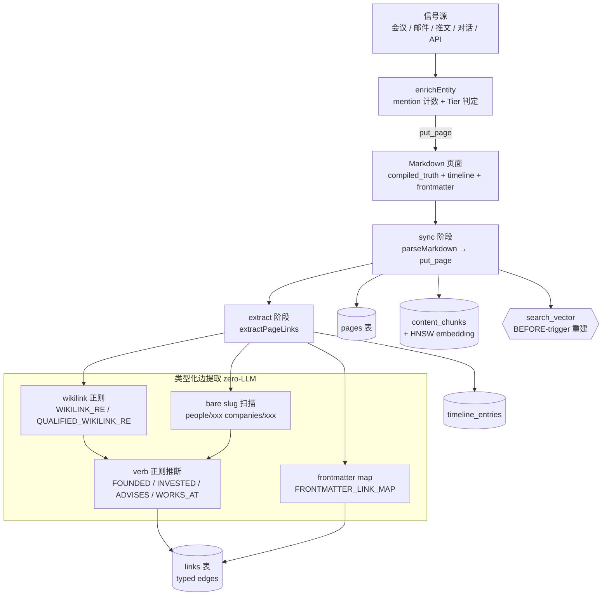
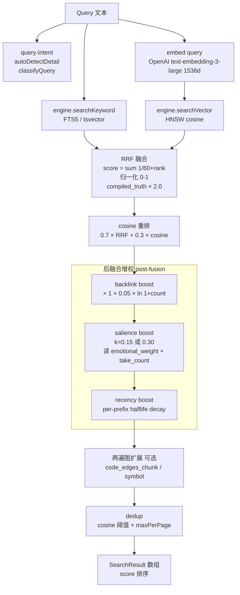
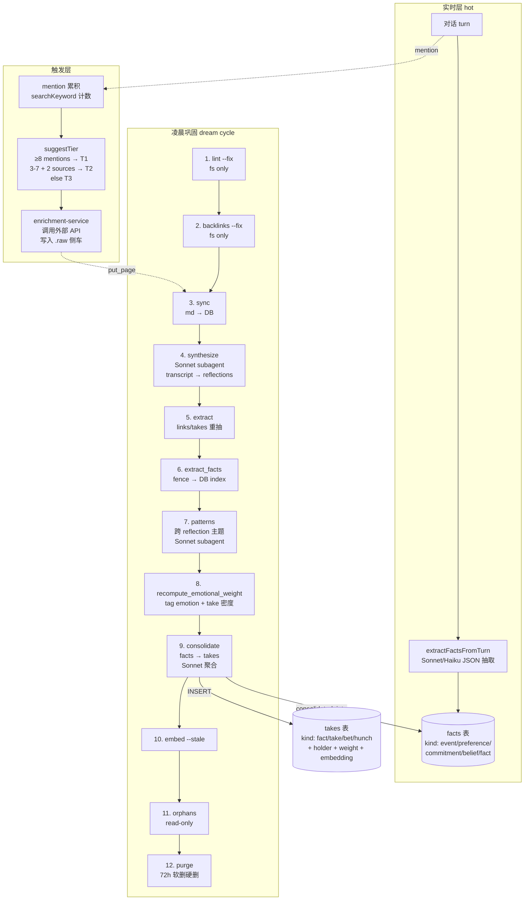
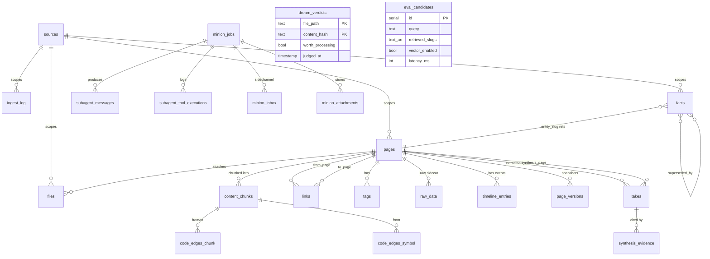

# GBrain 分析 — 数据与交互视角

> **本视角定位**：把 gbrain 的数据模型与三大数据流（写入 / 查询 / 自进化）拆到字段级、SQL 级、公式级，作为主人新方向「Agent 记忆与自进化引擎」的最直接借鉴蓝本。
> **结论先行（3 条）**：
> 1. gbrain 是「**Markdown 为真，DB 为索引**」的双层架构——所有真相住在带 frontmatter + 双层（compiled_truth + timeline）的 .md 文件里，Postgres 只是检索 / 增权 / 自进化的派生层。
> 2. 自连线（Self-wiring）**90% 零 LLM**——靠 wikilink 正则 + frontmatter 字段映射 + verb 正则推断 link_type，仅 takes/facts 抽取调用 LLM。
> 3. takes vs facts 是 gbrain 最大的认知设计创新——**facts = 热记忆（用户本人对话即时抽取）**、**takes = 冷信念（页面级、多 holder、带 weight）**，通过凌晨 dream consolidate 单向桥接。

---

## A. 数据流程图（DFD）

### A.1 写入流（Write Path）



**关键节点源码引用：**

- frontmatter map 入口 — `src/core/link-extraction.ts:611-631`（`FRONTMATTER_LINK_MAP`）
- wikilink 正则 — `src/core/link-extraction.ts:71-91`
- verb 推断 — `src/core/link-extraction.ts:461-557`（`inferLinkType` + 4 个 verb 正则）
- enrichEntity 主流程 — `src/core/enrichment-service.ts:72-145`
- Tier 升级判定 — `src/core/enrichment-service.ts:220-235`
- search_vector 重建触发器 — `src/schema.sql:521-546`

### A.2 查询流（Read Path）



**关键节点源码引用：**

- hybridSearch 主流程 — `src/core/search/hybrid.ts:211-410`
- RRF 公式 — `src/core/search/hybrid.ts:20`（`RRF_K = 60`）+ `:417-459`
- compiled_truth boost — `src/core/search/hybrid.ts:21`（`COMPILED_TRUTH_BOOST = 2.0`）
- cosine 重排公式 `0.7 RRF + 0.3 cosine` — `src/core/search/hybrid.ts:489-502`
- backlink boost 系数 0.05 — `src/core/search/hybrid.ts:31`（`BACKLINK_BOOST_COEF`）+ `:39-46`
- salience boost — `src/core/search/hybrid.ts:59-71`
- recency boost — `src/core/search/hybrid.ts:85-117`
- 后融合编排 — `src/core/search/hybrid.ts:136-187`（`runPostFusionStages`）

### A.3 自进化流（Self-evolve Path）



**关键节点源码引用：**

- 9 phase 编排 — `src/core/cycle.ts:14-30` + `:61-89`（`ALL_PHASES`）
- consolidate 注释 — `src/core/cycle.ts:77-82`
- facts hot 抽取 — `src/core/facts/extract.ts:131-223`
- facts 表定义 — `src/core/migrate.ts:2287-2356`（v40 迁移）
- takes 表定义 — `src/core/migrate.ts:1191-1224`（v37 迁移）
- synthesize 主体 — `src/core/cycle/synthesize.ts:1-100`（Sonnet subagent + dream_verdicts 缓存）
- patterns 主体 — `src/core/cycle/patterns.ts:37-100`
- cycle 锁 30 分钟 TTL — `src/core/cycle.ts:239-247`

---

## B. 实体关系图（ER）⭐⭐⭐

### B.1 完整 ER 图



### B.2 关键表卡片（按重要性排序）

#### sources — 多仓 / 多 brain 租户

```
表名：sources
作用：一个 source 是一个逻辑 brain（wiki / gstack / yc-media 等）
字段：
  id              TEXT PRIMARY KEY           不可变引用 key
  name            TEXT UNIQUE                可改显示名
  local_path      TEXT                       可选 git 检出根
  config          JSONB                      federated 标志 + ACL slot
  chunker_version TEXT                       chunker 升级时强制重 chunk
  archived        BOOLEAN                    软删除 + 72h 恢复窗
  archive_expires_at TIMESTAMPTZ
  created_at      TIMESTAMPTZ
```

#### pages — 核心内容表 ⭐

```
表名：pages
作用：每一个 .md 文件在 DB 的镜像（人 / 公司 / 会议 / 概念 / deal 统统在这一张表）
字段：
  id            SERIAL PK
  source_id     TEXT FK → sources
  slug          TEXT       唯一 per source（people/alice-chen）
  type          TEXT       person / company / meeting / concept / deal / media...
  page_kind     TEXT       markdown / code / image
  title         TEXT
  compiled_truth TEXT      ⭐ "compiled truth" 上半部
  timeline      TEXT       ⭐ append-only 下半部
  frontmatter   JSONB GIN  结构化元数据
  emotional_weight REAL    0-1 显著性分数（tag emotion + take 密度）
  effective_date TIMESTAMPTZ  recency boost 用
  search_vector TSVECTOR  触发器自动重建（A 权重 title + B compiled + C timeline）
  deleted_at    TIMESTAMPTZ  72h 软删除
约束：UNIQUE (source_id, slug)
```

（参见 `src/schema.sql:65-103`）

#### content_chunks — 向量索引层 ⭐

```
表名：content_chunks
作用：把每页切成 chunk + 1536 维 OpenAI 向量
字段：
  id            SERIAL PK
  page_id       INTEGER FK → pages
  chunk_index   INTEGER
  chunk_text    TEXT
  chunk_source  TEXT       compiled_truth / timeline / raw 等
  embedding     vector(1536)  HNSW + cosine_ops
  model         TEXT
  modality      TEXT       text / image
  embedding_image vector(1024)  Voyage 多模态
索引：
  HNSW (embedding vector_cosine_ops)            向量检索主索引
  GIN (search_vector)                            chunk-grain FTS
```

（参见 `src/schema.sql:129-175`）

#### links — 类型化边表 ⭐⭐

```
表名：links
作用：page → page 的有向类型化边（关系图谱主载体）
字段：
  id             SERIAL PK
  from_page_id   INTEGER FK → pages
  to_page_id     INTEGER FK → pages
  link_type      TEXT       founded / invested_in / advises / works_at / attended /
                            mentions / image_of / source / related_to / yc_partner /
                            led_round / discussed_in / image_of...
  context        TEXT       周围 240 字符上下文（推断 link_type 用）
  link_source    TEXT       markdown / frontmatter / manual
  origin_page_id INTEGER    frontmatter 来源页（用于回写时精准清理）
  origin_field   TEXT       frontmatter 字段名（key_people / investors...）
  resolution_type TEXT      qualified / unqualified（多 source wikilink）
约束：UNIQUE NULLS NOT DISTINCT (from, to, type, link_source, origin_page_id)
索引：from / to / source / origin 各一
```

（参见 `src/schema.sql:261-286`）

#### takes — 认知/信念层（v0.28）⭐⭐⭐

```
表名：takes
作用：「谁相信什么 + 多少置信度 + 何时」的多 holder 信念库
字段：
  id           BIGSERIAL PK
  page_id      INTEGER FK → pages
  row_num      INTEGER       page 内序号（markdown fence 解析出的）
  claim        TEXT          原文 take 字串
  kind         TEXT CHECK    fact / take / bet / hunch
  holder       TEXT          ⭐ people/garry-tan / world / brain / 任意 slug
  weight       REAL 0-1      置信度（默认 0.5；建议 0.05 步进）
  since_date   TEXT
  until_date   TEXT
  source       TEXT          来源标识
  superseded_by INTEGER      链式淘汰
  active       BOOLEAN       软淘汰开关
  resolved_at  TIMESTAMPTZ   bet 类型的兑现时间
  resolved_outcome BOOLEAN   bet 结果
  embedding    VECTOR(1536)  HNSW（active only）
约束：UNIQUE (page_id, row_num)
索引：page / kind+active / holder+active / weight+active DESC / HNSW
```

（参见 `src/core/migrate.ts:1191-1224`）

#### facts — 热记忆层（v0.31）⭐⭐⭐

```
表名：facts
作用：用户本人对话即时抽取的「热记忆」（单用户，real-time）
字段：
  id                BIGSERIAL PK
  source_id         TEXT      多 brain 隔离
  entity_slug       TEXT      指向 pages.slug
  fact              TEXT      claim 字串
  kind              TEXT CHECK event / preference / commitment / belief / fact
  visibility        TEXT      private / world
  notability        TEXT      high / medium / low（提取时由 LLM 标）
  context           TEXT
  valid_from        TIMESTAMPTZ
  valid_until       TIMESTAMPTZ
  expired_at        TIMESTAMPTZ   软淘汰
  superseded_by     BIGINT FK → facts
  consolidated_at   TIMESTAMPTZ   ⭐ 凌晨升 takes 后打戳
  consolidated_into BIGINT        指向升上去的 takes.id
  source            TEXT          mcp:put_page / mcp:extract_facts...
  source_session    TEXT
  confidence        REAL 0-1
  embedding         vector(N)
  embedded_at       TIMESTAMPTZ
  row_num               INTEGER   v0.32.2 fence 反向同步
  source_markdown_slug  TEXT
索引：
  entity+valid_from（active 局部）
  session
  unconsolidated（局部，consolidated_at IS NULL）
  HNSW embedding（active 局部）
```

（参见 `src/core/migrate.ts:2287-2356`）

#### synthesis_evidence — 引用追溯

```
表名：synthesis_evidence
作用：dream synthesize 写出的合成页引用了哪些 take（citation 索引）
字段：
  synthesis_page_id INTEGER FK → pages CASCADE
  take_page_id      INTEGER
  take_row_num      INTEGER
  citation_index    INTEGER
PK: (synthesis_page_id, take_page_id, take_row_num)
FK: (take_page_id, take_row_num) → takes(page_id, row_num) CASCADE
```

#### dream_verdicts — synthesize 增量缓存

```
表名：dream_verdicts
作用：Haiku 廉价判定 transcript 是否值得 Sonnet 处理的缓存
字段：
  file_path        TEXT PK
  content_hash     TEXT PK
  worth_processing BOOLEAN
  reasons          JSONB
  judged_at        TIMESTAMPTZ
```

#### gbrain_cycle_locks — 凌晨任务并发控制

```
表名：gbrain_cycle_locks
作用：保证同一 brain 同时只有一个 dream cycle 在跑（PgBouncer 安全）
字段：
  id              TEXT PK    gbrain-cycle
  holder_pid      INT
  holder_host     TEXT
  acquired_at     TIMESTAMPTZ
  ttl_expires_at  TIMESTAMPTZ  30 分钟
机制：TTL 过期自动可被新 holder 抢占（处理 crash）
```

#### eval_candidates — 检索质量回采

```
表名：eval_candidates
作用：每次 query/search 调用的真实回采，PII 已脱敏，CHECK query ≤ 50KB
字段：
  query              TEXT
  retrieved_slugs    TEXT[]    返回的 slug
  vector_enabled     BOOLEAN   向量是否真的跑了
  expansion_applied  BOOLEAN
  latency_ms         INTEGER
  detail_resolved    TEXT      low / medium / high
作用机制：底层组件之一，支持 BrainBench-Real eval（P@5 49.1% / R@5 97.9% 就是从这采出来的）
```

#### 其他重要表速览

| 表 | 作用 | 关键字段 |
|---|---|---|
| `tags` | 页面标签 | `page_id`, `tag` (UNIQUE) |
| `timeline_entries` | 结构化时间线（与 pages.timeline 文本互补） | `page_id`, `date`, `summary`, `detail` |
| `raw_data` | API 原始返回 JSON 侧车 | `page_id`, `source`, `data JSONB` |
| `page_versions` | compiled_truth 历史快照 | `page_id`, `compiled_truth`, `snapshot_at` |
| `ingest_log` | 同步日志 | `source_id`, `source_type`, `pages_updated` |
| `files` | 二进制附件（Supabase Storage） | `page_id`, `content_hash`, `storage_path` |
| `code_edges_chunk / symbol` | v0.20 代码 chunk 间的结构边 | `from_chunk_id`, `to_chunk_id`, `edge_type` |
| `minion_jobs` | BullMQ 风格的 PG 原生任务队列（dream subagent 用） | 50+ 字段，参见 `src/schema.sql:560-616` |
| `subagent_messages / tool_executions / rate_leases` | v0.16 durable LLM loop | message_idx / tool_use_id |
| `eval_takes_quality_runs / eval_contradictions_*` | takes 质量评测 + 矛盾探针 | rubric_version / judge_model |

---

## C. Takes vs Facts 模型解读 ⭐⭐⭐

### C.1 分界线

| 维度 | takes（冷信念） | facts（热记忆） |
|---|---|---|
| **本质** | 认识论层——「**谁**相信**什么**，置信度多少，时点是」 | 主人本人对话即时抽取的事实 |
| **范围** | 多 holder——任何说话人的信念都能存 | 单用户——只是 brain owner 说的 |
| **来源** | 页面 markdown 的 `## Takes` fence 块（v0.28 后） | 实时对话 turn（每轮 Sonnet/Haiku 抽取） |
| **kind** | `fact` / `take` / `bet` / `hunch` | `event` / `preference` / `commitment` / `belief` / `fact` |
| **生命周期** | 冷存储，回顾性，重新抽取时更新 | 热存储，实时，对话发生时抓 |
| **规模** | 成熟 brain 100K+ 行（横跨数千 holder） | 慢得多，按对话密度 |
| **桥接** | dream cycle 的 `consolidate` 阶段把 hot facts 单向升为 cold takes（夜间） | facts.consolidated_into → takes.id |

### C.2 为什么要分？解决了什么问题？

**核心问题：「主人说的」与「别人说的」必须分开存。**

把 Jared Friedman 对某公司的评价（`holder=people/jared-friedman kind=take`）和主人对那家公司的看法（`holder=brain kind=belief`）混在同一张表，会出现三类灾难：

1. **归因塌陷**——「Jared 觉得 Momo 留存强」会被算成主人的观点
2. **置信度错配**——别人的传闻 0.6 和主人亲口说的 1.0 在一张表里没法做合理排序
3. **检索污染**——用户问「我对 X 怎么看」会捞出全 brain 数百人对 X 的看法

### C.3 schema 里怎么体现

- **takes 必带 `holder` 字段**——这是 multi-holder 设计的核心，default `world`/`brain`，或任意 `people/xxx` slug。`src/core/migrate.ts:1197`
- **facts 无 holder 字段**——隐含 `holder = brain owner`。`src/core/migrate.ts:2289-2310`
- **facts.consolidated_into** + **facts.consolidated_at** 是单向桥的痕迹。`:2304-2305`
- **takes 内嵌 1536 维 embedding + HNSW（active only）**——可以做 take 之间的语义检索；facts 也有，但 active 局部索引（`consolidated_at IS NULL`）。

### C.4 生产实测数据（2026-05-10，~100K 页 brain）

| 指标 | 数值 |
|---|---|
| 总 takes | 100,720 |
| 来源页 | 28,256 |
| 模型 | Azure GPT-5.5（与 Opus 同质，1/8 价） |
| 成本 | $361.49 |
| 错误率 | 0.3% |
| 类型分布 | take 70960 / fact 24342 / bet 2875 / hunch 2649 |
| unique holder | 6,239 |
| 总体评分 | 6.8/10（GPT-5.5 + Opus 4.6 双盲打） |

最大坑：**Holder ≠ Subject**——「Garry has a hero/rescuer pattern」的 holder 应该是 `brain`（观察者）而不是 `people/garry-tan`（被观察对象）。

### C.5 主人能不能借鉴？

**强烈建议借鉴，但简化。** 详见 §G.3。要点：

- 主人的 Agent 既要存「主人本人的指示/偏好」（facts），又要存「主人引用的其他人观点」（takes）——这俩**必须分两张表**
- 但 takes 的 4 种 kind（fact/take/bet/hunch）可能过度——主人 v0.1 用 2 种（claim / observation）足够
- `holder` 字段是**必须保留的核心创新**，不能省

---

## D. 自连线（Self-wiring）机制深挖 ⭐⭐

README 反复强调「zero LLM 自连线」，实质拆解：

### D.1 哪一步零 LLM，哪一步 LLM 兜底

| 阶段 | 是否 LLM | 实现 |
|---|---|---|
| wikilink/markdown link 提取 | ❌ 零 LLM | 两条正则 `WIKILINK_RE` / `ENTITY_REF_RE`（`link-extraction.ts:58-91`） |
| frontmatter 字段 → 边类型 | ❌ 零 LLM | 静态 `FRONTMATTER_LINK_MAP` 数组（`link-extraction.ts:611-631`） |
| 显示名 → slug 解析（resolver） | ❌ 零 LLM | pg_trgm 模糊匹配 + slugify fallback（`entities/resolve.ts:31-114`） |
| link_type 推断 | ❌ 零 LLM | 4 条 verb 正则 + 3 条 role-prior 正则（`link-extraction.ts:461-558`） |
| takes 抽取 | ✅ LLM | Sonnet（pages.compiled_truth → `## Takes` fence） |
| facts 抽取 | ✅ LLM | Sonnet/Haiku（对话 turn → DB） |
| synthesize / patterns | ✅ LLM | Sonnet subagent（凌晨 transcript → reflection 页） |
| consolidate | ✅ LLM | Sonnet（facts 簇 → 单条 take） |

### D.2 类型化边怎么提取（zero-LLM 部分）

**两路并存：**

**路径 1：markdown 正文**
```
[Sam Altman](people/sam-altman)   ← markdown link
[[people/sam-altman]]              ← obsidian wikilink
[[wiki:people/sam-altman]]         ← v0.17 qualified wikilink
```
正则提到一个候选 `(EntityRef{name, slug, dir})`，然后调 `inferLinkType()` 在 240 字符上下文里跑 verb 正则：

| 正则 | 匹配示例 | 输出 link_type |
|---|---|---|
| `FOUNDED_RE` | "founded", "co-founded", "founder of" | `founded` |
| `INVESTED_RE` | "invested in", "led the seed", "portfolio company", "first check" | `invested_in` |
| `ADVISES_RE` | "advisor to", "advisory board", "in advisory capacity" | `advises` |
| `WORKS_AT_RE` | "CEO of", "engineer at", "her time at", "tenure as" | `works_at` |

优先级：`founded > invested_in > advises > works_at > role-prior > mentions`（`link-extraction.ts:528-558`）

**路径 2：frontmatter map（更可靠）**
```yaml
# people/alice.md
company: "Stripe"           → links: alice → stripe (works_at)
companies: [Stripe, Plaid]  → 两条 works_at
founded: [Acme]             → alice → acme (founded)

# companies/stripe.md
key_people: [Patrick, John] → patrick/john → stripe (works_at, incoming)
investors: [Sequoia]        → sequoia → stripe (invested_in, incoming)

# meetings/2026-05-04.md
attendees: [Garry, Pedro]   → garry/pedro → meeting (attended, incoming)
```
完整映射表见 `FRONTMATTER_LINK_MAP`（`link-extraction.ts:611-631`），含 11 条规则，覆盖 person/company/deal/meeting/source 等所有页类型。

**direction 设计很妙：**`incoming` 边的 from 是 frontmatter 值，to 是当前页——这样 `key_people: [Pedro]` 写在 `companies/stripe.md` 上，最终生成 `people/pedro → companies/stripe (works_at)`，**主谓宾正向语义**。

### D.3 反向链接传播是什么算法

不是真的「传播」（不会跨多跳推断新边），而是「**反向计数**」：
```sql
SELECT to_page_id, COUNT(*) FROM links
 WHERE to_page_id IN (...)
 GROUP BY to_page_id
```
然后在检索时把这个 count 算成 boost 因子。详见 D.4。

「自连线」真正神奇的是**幂等可重算**——
- `extract --rebuild` 删掉所有 frontmatter-derived 边，重跑全部 .md 文件，整张图重建
- 单页 `put_page` 时只清理 `link_source='frontmatter' AND origin_page_id=本页` 的边——精准外科手术
- `UNIQUE NULLS NOT DISTINCT` 约束让同一对节点的 markdown 边和 frontmatter 边并存而不冲突

### D.4 反向链接增权公式 ⭐

```python
# src/core/search/hybrid.ts:31, 39-46
BACKLINK_BOOST_COEF = 0.05

for r in results:
    count = backlink_counts.get(r.slug, 0)
    if count > 0:
        r.score *= (1.0 + BACKLINK_BOOST_COEF * log(1 + count))
```

| 反向链接数 | 增权因子 |
|---|---|
| 0 | 1.000 |
| 1 | 1.035 |
| 10 | 1.120 |
| 100 | 1.230 |

对数压缩——避免「全 brain 都被某个超级节点拉爆」，同时保留「重要节点排名上浮」的直觉。

---

## E. 混合检索机制（3-layer search 真相）

### E.1 三层不是 FTS+vector+graph 三选一，是**两源融合 + 图扩展**

| 层 | 是什么 | 实现 |
|---|---|---|
| L1 keyword | tsvector + GIN（A 权 title / B compiled / C timeline） | `engine.searchKeyword` |
| L2 vector | OpenAI 1536d 向量 + HNSW cosine | `engine.searchVector`（每个 query variant 一次） |
| **L3 graph** | code_edges 两跳遍历（v0.20，可选 opt-in） | `expandAnchors`（仅当 `walkDepth > 0` 或 `nearSymbol`） |

L1 + L2 始终融合；L3 默认 off，主要为代码检索（doc→symbol）服务。

### E.2 完整 ranking 公式

```
# 第一步：RRF 融合（默认每个 list 都参与）
RRF_score(item) = Σ_lists 1 / (60 + rank_in_list)

# 第二步：归一化到 0-1
norm_rrf = RRF_score / max(RRF_score)

# 第三步：compiled_truth boost（detail != 'high' 时）
boosted_rrf = norm_rrf × (2.0 if chunk_source == 'compiled_truth' else 1.0)

# 第四步：cosine 重排（向量真的跑了的话）
blended = 0.7 × normalized(boosted_rrf) + 0.3 × cosine(query_emb, chunk_emb)

# 第五步：post-fusion 三轴增权（multiplicative）
final = blended
  × (1 + 0.05 × ln(1 + backlink_count))                      # backlink boost
  × (1 + 0.15 × ln(1 + salience_score))                      # salience boost (k=0.15 'on' / 0.30 'strong')
  × (1 + strength_mul × coef × halflife/(halflife + days))   # recency boost (per-prefix decay)
```

其中：
- `salience_score = emotional_weight × 5 + ln(1 + take_count)`（`engine.ts:672`）
- recency 衰减是**按 slug 前缀**配置的（`media/articles/` 比 `concepts/` 衰减更快），见 `src/core/search/recency-decay.ts`

### E.3 P@5 49.1% / R@5 97.9% 怎么测的

源自 `eval_candidates` 表 + BrainBench-Real eval substrate（`src/core/search/eval.ts`）。机制：

1. 真实生产 query/search 调用全部回采到 `eval_candidates`（PII 已脱敏）
2. 人工/LLM 标注每个 query 的「正确答案 slug 集合」
3. 跑 eval：对每个 query 重放 retrieval，与正确集合对照
4. P@5 = top-5 命中正确数 / 5；R@5 = top-5 命中正确数 / 正确总数

R@5 97.9% 说明召回近乎天花板（几乎找得到），P@5 49.1% 说明 top-5 仍有一半是噪声——这是「召回够强但精度仍差」的典型形态，**符合 hybrid search 还没上重排器（Cohere reranker / Voyage rerank-2）的状态**。

---

## F. Dream Cycle 凌晨自进化数据流 ⭐⭐

### F.1 12 phase 全景

```
Phase                              产出物                                  LLM？
1.  lint --fix                    fs 写入（frontmatter 修复）              ❌
2.  backlinks --fix               fs 写入（补充缺失反向链接）              ❌
3.  sync                          DB 写入（pages/chunks/links）            ❌（embed 调一次 OpenAI）
4.  synthesize                    新 pages（reflections, originals）        ✅ Sonnet subagent（每个有意义 transcript 一个）
5.  extract                       DB 写入（重抽 links / timeline）          ❌
6.  extract_facts                 facts 表索引重建（fence 解析）            ❌
7.  patterns                      新 pages（跨 reflection 主题）            ✅ Sonnet subagent（1 个，跑全 lookback 窗）
8.  recompute_emotional_weight    DB 写入（pages.emotional_weight 列）      ❌（确定性，tag emotion 字典 + take 密度）
9.  consolidate                   takes 表写入 + facts.consolidated_into    ✅ Sonnet（每个 entity 簇一次）
10. embed --stale                 chunks.embedding / takes.embedding 补全   ❌（调 OpenAI embedding）
11. orphans                       报告（无 inbound link 的页）              ❌
12. purge                         硬删 72h 软删过期数据                     ❌
```

### F.2 synthesize / patterns / reflections / originals 各是什么

- **transcript** — 对话原始文本（`meetings/transcripts/*.md`，通常 db_only 不入 git）
- **reflection** — synthesize 阶段从一段 transcript 蒸馏出的「主人此刻在想什么 + 决定了什么」（output 到 `originals/reflections/2026-05-12-xxx.md`）
- **original** — 主人本人原创性输出（synth 阶段从 transcript 里识别「这段是新观点不是讨论」并升级）
- **pattern** — patterns 阶段跨多个 reflection 找的反复出现的主题（output 到 `patterns/xxx.md`，要求 ≥ `min_evidence` 个不同 reflection 支撑）

### F.3 数据从哪来到哪去

```
transcripts/*.md            （raw，源外部，db_only）
   │ synthesize 判定 worth (Haiku 缓存到 dream_verdicts)
   ▼ Sonnet subagent
originals/reflections/*.md  （compiled_truth + timeline，git-tracked）
   │ extract（zero-LLM）
   ▼
links + timeline_entries    （DB 索引）
   │ extract_facts（zero-LLM）+ consolidate（Sonnet）
   ▼
facts 表（hot）→ takes 表（cold，markdown fence 同步）
   │ patterns（Sonnet subagent，lookback_days 窗口）
   ▼
patterns/*.md               （新页面，引用 take row via synthesis_evidence）
```

### F.4 「真的无监督」吗？

**否，需要 LLM 介入但有严格预算护栏。** 设计上的「自动」体现在：

- 调度自动——`gbrain autopilot` daemon 周期性触发或 Minions `autopilot-cycle` handler
- 增量自动——`dream_verdicts` 缓存（content_hash 命中就跳过）+ `dream.synthesize.last_completion_ts` 冷却
- 写入受限——subagent **不直接给 fs 写权**（`Hard guarantees` 见 `src/core/cycle/synthesize.ts:14-22`）；orchestrator 持 dual-write
- allow-list 锁——`allowed_slug_prefixes` 来自 `skills/_brain-filing-rules.json`（单一可信来源）

但凡用到 LLM 的 phase（synthesize / patterns / consolidate）都吃 token、有成本（参考 §C.4 的 $361.49/100K 页）。「无监督」≠「免费」，是「不要主人手动盯」。

---

## G. 对主人新方向（Agent 记忆与自进化）的启示 ⭐⭐

### G.1 schema 最低必须表（v0.1 起步）

| 优先级 | 表 | 借鉴自 gbrain | 主人 v0.1 必要性 |
|---|---|---|---|
| 🔴 必备 | `pages` | 同名 | 任何记忆系统都需要一个「记忆单元」表 |
| 🔴 必备 | `content_chunks` + 向量 + HNSW | 同名 | 召回基础（OpenAI/通义 1536d 都行） |
| 🔴 必备 | `links`（类型化边） | 同名 | 关系图谱基础——区分 `mentioned` / `replied_to` / `derived_from` 等 |
| 🟡 强烈推荐 | `facts`（热记忆，含 holder=主人） | 简化版（去掉 source_id） | Agent 实时记住主人偏好/承诺 |
| 🟡 强烈推荐 | `tags` | 同名 | 简单分类够用 |
| 🟢 可选 v0.2 | `takes`（多 holder 信念） | 简化（kind 改为 claim/observation 二选一） | 等主人需要存「第三方观点」时再加 |
| 🟢 可选 v0.2 | `timeline_entries` | 同名 | 当主人需要时间维度检索时加 |
| 🔵 v0.3+ | `dream_verdicts` / `gbrain_cycle_locks` | 同名 | 等接入凌晨自进化时再加 |

### G.2 自连线机制——**值得照搬**

主人的 Agent 记忆系统几乎一定要做自连线，且 gbrain 的 zero-LLM 方案**最经济**：

- **保留**：wikilink 正则 + frontmatter map → 类型化边
- **保留**：pg_trgm 模糊解析 slug
- **简化**：verb 正则可以从 4 类减到 1-2 类（主人初期不需要区分 invested_in vs advises，统一 `mentioned` 也行）
- **必加**：反向链接增权公式 `score × (1 + 0.05 × ln(1+count))`——立竿见影提升「热门记忆优先」的检索质量

### G.3 takes vs facts 二分模型——**部分借鉴**

主人的 Agent 场景：
- **绝对要分**——「主人本人说的」必须和「主人引用的别人观点」分开（同 gbrain）
- **kind 简化**——v0.1 只要 2 种 kind 足够，gbrain 的 9 种（5 facts + 4 takes）等真实用例长出来再加
- **holder 字段必须保留**——这是多用户 / 多视角支持的根

**主人 schema 建议（极简）：**
```sql
-- v0.1 极简版
facts (
  id, fact, kind ENUM('preference','commitment','event','belief'),
  source_session, confidence, embedding, created_at, expired_at
)

-- v0.2 加 takes 当主人开始喂入外部专家观点时
takes (
  id, claim, holder TEXT,  -- 'self' / 'expert:xxx' / 'paper:yyy'
  kind ENUM('claim','observation'),
  weight REAL, embedding, source, active
)
```

### G.4 dream cycle 是否值得借鉴？

**v0.1 不做，v0.2 简化做。**

gbrain 的 12 phase 太重，主人新方向初期不需要。**最低实现**：

```
每日凌晨：
  1. consolidate-only — 把昨天的 facts 聚类（embedding 相似度 > 0.85）
                       同主题的多条 facts 合并成 1 条 take，写 consolidated_into
  2. embed --stale — 给昨天新增的 facts/takes 补 embedding
```

不要碰：synthesize（要 LLM subagent + minion 队列）/ patterns（要 Sonnet + 大窗口） / extract_facts（fence 反向同步太重）。

但 v0.3+ 可以陆续加，gbrain 的 phase 顺序设计（先 lint → 后 sync → 后 extract → 后 consolidate → 后 embed → 后 purge）就是教科书级别的「**依赖关系驱动**」。

### G.5 反向链接增权该不该作默认 ranking？

**该。** 公式 `score × (1 + 0.05 × ln(1 + count))` 简单到 5 行代码，对数压缩天然防爆，对主人记忆场景几乎一定增益。

补充建议：
- **加 recency 衰减**——主人的偏好/承诺有时效性，gbrain 的 per-prefix halflife 模式可以照搬：日常对话 halflife=30d，长期偏好 halflife=∞
- **加 salience boost**——把 `emotional_weight` 简化为「主人显式打的星标 + take 引用数」就够 v0.1

### G.6 Markdown-as-truth 架构是否照搬？

**强烈推荐**，理由：
- **可读**——主人可以直接 vim / Obsidian 打开看（gbrain 的最大优势之一）
- **可备份**——git 管理，丢失 DB 不丢知识
- **可迁移**——换 DB 引擎（pgvector → sqlite-vss → chroma）不丢内容
- **gbrain 的 db_only / db_tracked 分层很妙**——大量机器生成内容（转录、推文）走 db_only 不污染 git；核心知识走 db_tracked

主人 v0.1 直接复用这个模式：
```
~/.agent-memory/
├── facts/         (db_tracked，可读 markdown，主人偏好)
├── notes/         (db_tracked，长记忆笔记)
├── raw/           (db_only，原始对话日志)
└── .agent-memory.db  (pgvector 索引)
```

### G.7 ⚠️ 必看的踩坑预警（gbrain 用真金白银教训出来的）

| 坑 | gbrain 教训 | 主人对策 |
|---|---|---|
| Holder ≠ Subject 混淆 | takes 抽取首次跑出 6.5/10 attribution 分 | prompt 显式举反例（"X has Y pattern" → holder=brain） |
| 大规模 embedding 成本 | 100K 页 $361 一次 | 用便宜模型 + 增量重 embed（参考 dream_verdicts 缓存机制） |
| 多端并发写入冲突 | index.md / log.md 是 merge hotspot | log 追加格式 + index 视为派生（启发自 gbrain `Write hotspots`） |
| LLM 自我消费 loop | synthesize 写出的 reflection 又被吃进去再 synthesize | facts/extract.ts 显式 `isDreamGenerated` 跳过 |
| FTS + 向量召回都不够 | P@5 49% 说明缺重排器 | v0.2 加 Cohere/Voyage rerank-2 重排，预算允许就上 |

---

## H. 视角总结

gbrain 的数据层设计能在 100K+ 页 brain 上稳定运转，三个支柱：

1. **Markdown 为真，DB 为索引**——人读、git 管、可迁移
2. **类型化边自连线**——90% 零 LLM，verb 正则 + frontmatter map 做到 70-94% 类型准确率
3. **takes vs facts 二分**——把「热记忆 → 冷信念」的单向桥用 `consolidated_into` 字段实体化

对主人新方向最大启示——**不要一开始就建复杂图谱**。从 `pages + content_chunks + links + facts` 四张表起步，加 hybridSearch 的 RRF + backlink boost 增权两个公式，就能拿到能用的 v0.1。需要 takes / patterns / synthesize 时再渐进式扩展，每一步都对照 gbrain 的对应实现去裁剪。

**核心借鉴清单：**

- ✅ pages 表「双层 compiled_truth + timeline」结构
- ✅ links 表 + frontmatter_link_map 自连线
- ✅ 反向链接对数增权公式
- ✅ takes / facts 二分（holder 字段必留）
- ✅ Markdown-as-truth + db_tracked / db_only 分层
- ⚠️ dream cycle 12 phase 太重，挑 consolidate + embed 两个先做
- ❌ minion_jobs / subagent runtime 框架可以不抄，主人有 Claude Code 当 orchestrator

---

*分析依据：gbrain `master` 分支（commit 时间近 2026-05-12），核心源文件 8 个、设计文档 4 篇、schema 922 行全读，配合 grep 检索定位关键实现。*
