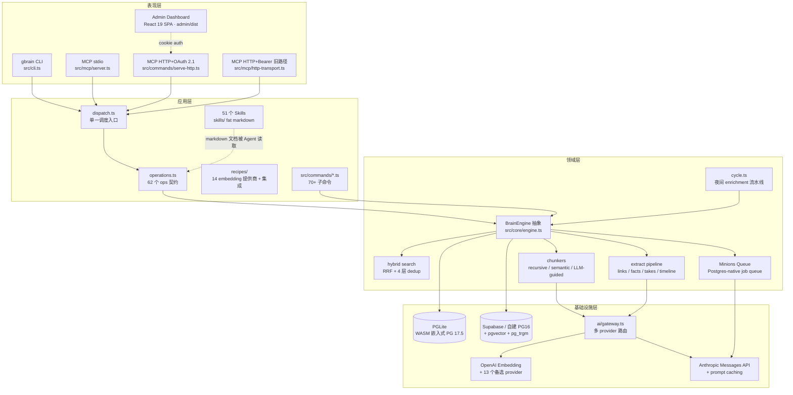
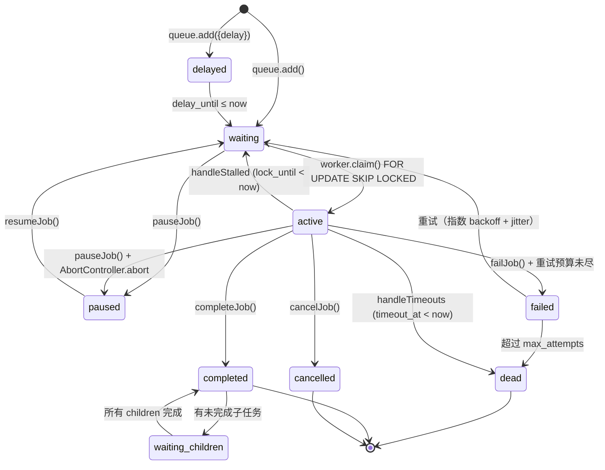

# GBrain 技术落地与运维视角

> 一句话定位：**Postgres-native 个人知识大脑**——Bun + TypeScript + PGLite/Supabase 双引擎，MCP 协议（stdio + HTTP+OAuth 2.1）对外暴露 62 个 ops，靠 Minions（自建 Postgres-native 任务队列）做异步编排，三套评测体系（BrainBench / LongMemEval / BrainBench-Real）防回归。架构哲学：**Thin Harness, Fat Skills**——引擎只做确定性的检索/存储/排序，所有"判断"放给 Skills（fat markdown）+ Agent。

---

## A. 系统逻辑架构图（分层结构）



**关键依赖关系：**
- 表现层全部通过 `dispatch.ts` 这一个调度入口（参见 `src/mcp/dispatch.ts:218`），保证 stdio / HTTP+OAuth / HTTP+Bearer / CLI 四个入口对 op 的参数校验、错误格式、AuthInfo 透传完全一致——历史上 PR #483 的反向参数 bug 就是因为 stdio 和 HTTP 各自实现而失同步，重构后强制收口。
- `BrainEngine` 接口（`src/core/engine.ts:1287` 行总长）是所有领域逻辑的契约，PGLite 和 Postgres 两个实现都必须实现全部约 37 个方法（不允许 optional 方法）。
- Skills 不是代码——是 fat markdown，Agent 通过文件路径直接读，引擎不解释也不执行。

---

## B. 技术架构图（技术栈全景）

| 层 | 技术 | 版本 | 作用 |
|---|---|---|---|
| 运行时 | **Bun** | ≥1.3.10 | JS 运行时 + 包管理 + bundler + 编译为单二进制（`bun build --compile`）|
| 语言 | TypeScript | ^5.6 | 严格模式 + `allowImportingTsExtensions`（直接跑 `.ts` 无需编译）|
| 模块系统 | ESNext + bundler resolution | – | `import` 时显式写 `.ts` 后缀，path alias `@/*` |
| 数据库（本地） | **PGLite** | 0.4.3 | ElectricSQL 出品的 WASM 嵌入式 Postgres 17.5，零配置默认 |
| 数据库（云） | Supabase / 自建 PG | PG 16 | 通过 `pgvector/pgvector:pg16` Docker 镜像 + Supavisor pooler |
| 关系数据库驱动 | postgres（porsager） | ^3.4 | 直接连 Postgres，pgBouncer 6543 自动检测关闭 prepared statements |
| 向量扩展 | **pgvector** | ^0.2 | HNSW 索引，cosine 距离，PGLite 和 Postgres 同一份 SQL |
| 全文检索 | PostgreSQL tsvector + ts_rank | – | GIN 索引；title(A) / compiled_truth(B) / timeline(C) 三权重 |
| 模糊匹配 | pg_trgm + GIN | – | 模糊 slug 解析 |
| MCP 协议 SDK | **@modelcontextprotocol/sdk** | 1.29.0 | 同时驱动 stdio 和 HTTP streamable transport |
| Anthropic SDK | @anthropic-ai/sdk | ^0.30 | Subagent loop + prompt caching markers |
| AI SDK（多 provider） | ai + @ai-sdk/anthropic/google/openai + openai-compatible | ^6.0 / ^3.0 | 统一 LLM 接口 |
| Embedding | OpenAI text-embedding-3-large（1536 维，默认）| – | 备选 13 个：Voyage / Google / Azure / MiniMax / DashScope / Zhipu / Ollama / llama-server / LiteLLM / Together 等 |
| HTTP Server | **express 5 + cors + cookie-parser + express-rate-limit** | ^5.1 | OAuth 路径用 express；裸 Bearer 路径直接用 `Bun.serve` |
| Admin UI | **React 19 + Vite 6** | 19.1 / 6.3 | SPA，构建产物 232KB 未压缩 / **gzip 约 67KB**（实测 `index-*.js` 68625 字节 gzip） |
| OAuth 2.1 | 自实现 OAuthServerProvider | – | PKCE + Dynamic Client Registration + client_credentials + token rotation |
| Job Queue | **Minions**（自建） | 7 次 schema 迁移 | BullMQ-inspired，纯 Postgres，`SKIP LOCKED` + advisory lock + `pg_notify` |
| Job Supervisor | 自实现 | – | PID 文件 O_CREAT\|O_EXCL 原子锁 + 指数退避 1s→60s + tini 僵尸进程回收 |
| 测试 | bun:test | – | 60s timeout（PGLite WASM cold start 慢）；4 路 E2E 分片避免 TRUNCATE 竞态 |
| 鉴权（Bearer 路径） | SHA-256 token hash | – | 存 access_tokens 表 |
| Markdown 解析 | gray-matter + marked | ^4 / ^18 | YAML frontmatter |
| 代码解析 | tree-sitter-wasms | 0.1.13 | 165 种语言懒加载 grammar，code search 用 |
| Tokenizer | @dqbd/tiktoken | ^1.0.22 | 成本预估 |
| 图像处理 | @jsquash/avif + @jsquash/png + heic-decode + exifr | – | 多模态导入 |
| 对象存储 | @aws-sdk/client-s3 | ^3.1028 | 二进制附件存储后端 |
| 校验 | zod | ^4.3 | 运行时 schema 校验 |
| CI 编排 | docker-compose | – | 4×pgvector/pgvector:pg16 + oven/bun:1 runner，分片并行 E2E |

**版本一致性约束：**
- PGLite WASM 内置在产物里，CI 有 `scripts/check-wasm-embedded.sh` 守门
- Admin React 编译产物有 CI 检查 `scripts/check-admin-build.sh` 守门
- Postgres 和 PGLite 用同一份 DDL（PGLite 自带 `pglite-schema.ts`，主仓 schema 在 `src/schema.sql`），保证 SQL 不分叉

---

## C. ⭐ Engine 抽象层（PGLite ↔ Supabase 双轨）

### C.1 为什么双轨？

**两类用户的取舍完全不同**（参见 `docs/ENGINES.md`）：

| 用户场景 | 痛点 | 适配引擎 |
|---|---|---|
| 第一次试用 / 开源 hacker | 不想注册账号、不想跑 Docker | **PGLite**：`gbrain init` 一行，DB 在 `~/.gbrain/brain.db` |
| Power user（Garry 自己，7K+ 页） | 要并发、要备份、要 RLS | **Supabase**：Pro $25/月，零运维 |
| 团队 / 企业 | 多人写、审计 | 自建 Postgres + 自定义 |
| 边缘 / 移动 | 离线优先 | PGLite（未来加 sync） |

PGLite 的关键卖点是它**不是另一种 SQL 方言**——而是 Postgres 17.5 编译成 WASM 在进程内跑。和 Supabase 的 Postgres 跑同一份 DDL、同一个 `pgvector` HNSW、同一套 `tsvector + ts_rank`、同一个 `pg_trgm`。这才是这个抽象敢做的根本。

### C.2 BrainEngine 接口抽象了什么

`src/core/engine.ts` 全部 1287 行，定义了约 37 个方法的契约，分七类：

| 类 | 方法举例 |
|---|---|
| 生命周期 | `connect`, `disconnect`, `initSchema`, `transaction` |
| Pages CRUD | `getPage`, `putPage`, `deletePage`, `listPages` |
| 搜索 | `searchKeyword`, `searchVector`（注意：embedding 生成不在 engine 里） |
| Chunks | `upsertChunks`, `getChunks`, `getChunksWithEmbeddings` |
| 图 | `addLink`, `getBacklinks`, `traverseGraph` |
| Tags / Timeline / RawData / Versions | … |
| 运维 | `getStats`, `getHealth`, `runMigration`, `logIngest`, `getConfig` |

**两条关键设计选择**：

1. **Slug-based API，不暴露数字 ID**——每个方法都吃 slug，引擎内部解析。可移植：slug 是字符串，ID 是 DB-specific。
2. **Embedding 不在 engine 里**——`src/core/embedding.ts` 是独立服务（参见 `src/core/embedding.ts:22`），所有引擎共享。理由：embedding 是外部 API 调用（OpenAI/Voyage/...），不是存储关切。chunking 同理（`src/core/chunkers/`）。

这样新加引擎（比如未来的 DuckDB、Turso）只要实现 BrainEngine，不需要重复实现 chunking 和 embedding。

### C.3 engine-factory 切换机制

代码极简（参见 `src/core/engine-factory.ts:8-26`）：

```typescript
export async function createEngine(config: EngineConfig): Promise<BrainEngine> {
  const engineType = config.engine || 'postgres';
  switch (engineType) {
    case 'pglite': {
      const { PGLiteEngine } = await import('./pglite-engine.ts');
      return new PGLiteEngine();
    }
    case 'postgres': {
      const { PostgresEngine } = await import('./postgres-engine.ts');
      return new PostgresEngine();
    }
    default: throw new Error(...);
  }
}
```

**巧思：动态 import**——PGLite WASM 体积大（几 MB），Postgres 用户启动时根本不应该加载。`await import('./pglite-engine.ts')` 让 bundler 把 PGLite 拆成独立 chunk，按需加载。同样 Postgres 路径不会拖入 PGLite WASM。

### C.4 跨引擎 schema 兼容性

**核心保证**：两边都跑真 Postgres SQL。差别只有：
- PGLite **不支持** `LISTEN/NOTIFY` → Minions 在 PGLite 下降级为 2s 轮询（`docs/designs/MINIONS_AGENT_ORCHESTRATION.md` PGLite Compatibility Matrix）
- PGLite **单进程独占文件锁** → Supervisor 子系统直接拒绝 PGLite 后端（`src/core/minions/supervisor.ts:9`）
- HTTP+Bearer 路径要求两边都有 `access_tokens` / `mcp_request_log` 表，所以 PGLite 也照着 schema.sql 同步建表

`gbrain migrate --to supabase` / `gbrain migrate --to pglite` 双向无损迁移：导出所有 pages/chunks/embeddings/links/tags/timeline，再导入。

### C.5 "零运维本地优先 + 可选云" 的产品策略巧思

这是 GBrain 最值得借鉴的产品设计选择：
- **冷启动门槛 = 0**：试用不需要任何账号、信用卡、Docker
- **顺势升级路径**：等用户真正用得多了（>1000 文件），一行命令迁到 Supabase
- **不锁定**：随时迁回；DB 是 derived cache，**真正的 system of record 是 markdown 仓**（参见 `docs/architecture/system-of-record.md`）——这点最关键，DB 坏了一个 `gbrain rebuild --confirm-destructive` 重建

这个策略叫 **"the DB is a derived index, the git repo is the source of truth"**。

---

## D. ⭐ MCP 实现（stdio + HTTP+OAuth 双形态）

GBrain 在 MCP 协议上做了**三种 transport** 共存，靠 `src/mcp/dispatch.ts` 收口：

### D.1 stdio MCP（本地 pipe，零认证）

代码：`src/mcp/server.ts:11-72`（仅 72 行，惊人地薄）。

- 协议 SDK：`@modelcontextprotocol/sdk` v1.29.0
- 进程：`gbrain serve`（无 `--http`）
- 认证：**无**（stdin/stdout pipe，本地默认信任）
- 工具列表：通过 `buildToolDefs(operations)` 把 62 个 ops 全部映射成 MCP tool（参见 `src/mcp/tool-defs.ts:13`）
- 关键 dispatch：`dispatchToolCall(engine, name, params, { remote: true, takesHoldersAllowList: ['world'], sourceId: process.env.GBRAIN_SOURCE || 'default' })`

**安全姿态**：即使本地 pipe 也默认 `remote: true`、`takesHoldersAllowList: ['world']`——也就是 stdio 调用方默认只能看 `holder = 'world'` 的公共 takes，不能读私有 hunches。要看私有数据，operator 用 `gbrain call` 直跑（remote=false）。这是 v0.28 引入的边界（参见 `src/mcp/server.ts:36-43`）。

**优雅退出**：MCP client 断开（stdin EOF）、SIGTERM/SIGINT/SIGHUP 都会触发 `engine.disconnect()` 后退出，防止"孤儿 serve 进程堆积争抢 PGLite 写锁"（参见 `src/mcp/server.ts:53-71`）。这种细节是生产里被坑过才补上的。

### D.2 HTTP+Bearer（推荐的远程路径，自包含）

代码：`src/mcp/http-transport.ts`（365 行）。

- 进程：`gbrain serve --http --port 8787`
- 认证：`Authorization: Bearer <token>`；token 由 CLI 命令 `gbrain auth create <name>` 颁发，SHA-256 hash 入 `access_tokens` 表
- **没有 OAuth、没有 /register、没有 client_credentials**——SECURITY.md 第一条就是：**不要用 open OAuth 注册**

硬化层：
- CORS 默认拒绝，需要 `GBRAIN_HTTP_CORS_ORIGIN=https://...` 显式开
- 两层速率限制：pre-auth IP（30 req/60s，挡爆破）+ post-auth token（60 req/60s，挡失控 client）
- LRU 限制（默认 10K keys）防 key-flood OOM
- Body cap 1 MiB 流式计数（chunked transfer 也卡得住）
- `mcp_request_log` 表每请求一行，**默认 redacted**（v0.26.9）——只记 shape 不记内容，防个人知识库被广播泄露（参见 `src/mcp/dispatch.ts:80-127`）
- `last_used_at` debounce：每 token 每 60 秒最多 UPDATE 一次（SQL `WHERE` 防写风暴）

### D.3 HTTP+OAuth 2.1（兼容 ChatGPT、Claude Desktop 等公网客户端）

代码：`src/commands/serve-http.ts`（1083 行，最厚的入口）+ `src/core/oauth-provider.ts`（641 行）。

- 进程：同上 `gbrain serve --http`，但通过 MCP SDK 的 `mcpAuthRouter` 暴露 OAuth 端点
- 支持的 grant：
  - `authorization_code` + **PKCE**（ChatGPT 强制要求，v0.26.0 才补上）
  - `client_credentials`（自实现，SDK 不支持）——给 Perplexity 这种 M2M client
- 支持：Dynamic Client Registration（RFC 7591）、token refresh with rotation、revocation
- Scope 层次（`src/core/scope.ts:25-57`）：

```
                admin
                  │
   ┌──────────┬───┴────┬──────────┐
   ▼          ▼        ▼          ▼
sources_admin users_admin write  read
                          │       ▲
                          └───────┘
```

`admin` 满足一切；`write` 隐含 `read`；两个 `*_admin` 互不隐含。

- `dispatchToolCall` 同样吃 `auth: AuthInfo`，op handler 可以 introspect 调用方（whoami op 用得到）
- **redirect_uri 校验** RFC 6749 §3.1.2.1：生产 redirect 必须 HTTPS，例外只允许 loopback（127.0.0.1 / ::1 / localhost）。CSO 安全审计标过的攻击（malicious `,` 作 redirect_uri 数组 smuggling）已加固——`pgArray` 显式转义双引号和反斜杠（`src/core/oauth-provider.ts:46-50`）。

### D.4 Admin Dashboard 怎么实现

- 技术栈：**React 19 + Vite 6**，纯 SPA
- 入口：`admin/src/main.tsx` → `App.tsx`，路由用 `window.location.hash`（不引入 react-router 省体积）
- 4 个页面：Login / Dashboard / Agents / RequestLog（`admin/src/pages/`）
- 构建产物：`admin/dist/assets/index-*.js` 224961 字节 → gzip 68625 字节 ≈ **67KB gzip**（草稿里说的"65KB"基本一致）
- 服务方式：`serve-http.ts:752-763` 用 `express.static(adminDistPath)` 把 `admin/dist` 挂到 `/admin`，所有未匹配的 `/admin/*` 走 SPA fallback 返回 `index.html`
- 认证：cookie auth（admin bootstrap token + magic link nonce）
- 实时日志：`/admin/events` 是 SSE（Server-Sent Events），每个 MCP 请求 broadcast 一条
- 设计风格：单色基底 + 语义色徽章，Inter + JetBrains Mono，参考 Supabase / Linear / Grafana（`admin/DESIGN.md`）

**Scope drift 防御**：admin 的 scope 常量是 `src/core/scope.ts` 的**手工镜像**在 `admin/src/lib/scope-constants.ts`，CI 有 `scripts/check-admin-scope-drift.sh` 比对。这是双仓双语言（TS 源 + 编译 SPA）共享常量的实用做法。

---

## E. ⭐⭐ Minions（durable job queue 子系统）

设计文档：`docs/designs/MINIONS_AGENT_ORCHESTRATION.md`（449 行），代码：`src/core/minions/` 共 4375 行 17 个模块。**这是 GBrain 最有借鉴价值的子系统**。

### E.1 为什么不用 BullMQ / Sidekiq / Celery？

设计文档明示借鉴 BullMQ（`src/core/minions/queue.ts:1-2`：BullMQ-inspired Postgres-native job queue），但**不引入 BullMQ 本体**。原因可推：

1. **零外部依赖**——BullMQ 要 Redis，违背"个人知识大脑零运维"的核心约束
2. **PGLite 兼容**——本地用户也要能跑后台任务；Redis 在 PGLite 模式下无意义
3. **一致的存储事务**——job 状态机和业务表（pages/chunks/...）在同一个 PG 事务里走，子任务和父任务的级联完成不需要跨系统两阶段提交
4. **Garry 的另一个核心信念**：The DB is the API。Agent 通过 MCP 操作 minion_jobs 表，dashboard 直接 query 同一张表，没有第二个 API surface

借鉴 Hatchet/pgflow/pgmq 的思路也走在一条线上。Sidekiq/Celery 路线需要单独的 broker + worker pool，运维成本对个人产品不划算。

### E.2 Postgres-native durable queue 怎么实现

**核心 SQL 模式（`src/core/minions/queue.ts:546-565`）**：

```sql
UPDATE minion_jobs SET
  status = 'active',
  lock_token = $1,
  lock_until = now() + ($2::double precision * interval '1 millisecond'),
  timeout_at = CASE WHEN timeout_ms IS NOT NULL
                    THEN now() + (timeout_ms::double precision * interval '1 millisecond')
                    ELSE NULL END,
  attempts_started = attempts_started + 1,
  started_at = COALESCE(started_at, now()),
  updated_at = now()
WHERE id = (
  SELECT id FROM minion_jobs
  WHERE queue = $3 AND status = 'waiting' AND name = ANY($4)
  ORDER BY priority ASC, created_at ASC
  FOR UPDATE SKIP LOCKED
  LIMIT 1
)
RETURNING *
```

三个关键技术点：
- **`FOR UPDATE SKIP LOCKED`**：多 worker 并发抢任务零冲突。这是 Postgres 9.5+ 的标准做法，BullMQ-on-Postgres 流派的灵魂
- **`lock_token` + `lock_until`**：worker 拿到 job 后续操作必须带这个 token（fencing），防止 stalled worker 在被重新分配后还能写脏数据
- **递增 `attempts_started`，不递增 `attempts_made`**：重试预算和实际完成次数解耦

**父子任务并发上限的 advisory lock**（`src/core/minions/queue.ts:144-149`）：

```sql
SELECT pg_advisory_xact_lock(hashtext('minion_maxwaiting:' || $1 || ':' || $2))
```

两个并发 submit 都看到 `count = N-1`、都 insert，会破坏 `max_children` 上限。事务级 advisory lock 让 cap 检查序列化。PGLite 也支持 `pg_advisory_xact_lock`，所以跨引擎不分叉。

**实时事件**：Postgres 后端用 `pg_notify` 触发器（在 `status` 列变更时 NOTIFY），订阅方 `LISTEN 'minion_jobs'` 拿到 sub-second 事件。PGLite **不支持** LISTEN/NOTIFY，自动降级为 2 秒轮询（`docs/designs/MINIONS_AGENT_ORCHESTRATION.md` §1）。

### E.3 状态机



九种状态：`waiting / active / completed / failed / delayed / dead / cancelled / waiting-children / paused`（`src/core/minions/types.ts:18-27`）。

### E.4 子任务（subagent）的设计选择

`subagent` job 是 LLM 推理任务（`src/core/minions/handlers/subagent.ts`），跑 Anthropic Messages API 对话循环。

**关键差别**——草稿里提到的"753ms vs 10s timeout"在源码里没有直接数字，但实际差异在设计哲学：

| 维度 | Minion claim/复活路径 | LLM call（subagent 内部） |
|---|---|---|
| 操作 | `UPDATE ... FOR UPDATE SKIP LOCKED` 一条 SQL | HTTPS to api.anthropic.com，等模型生成 |
| 典型耗时 | 毫秒级（一次 PG round trip） | 秒到分钟级（取决于上下文 + 模型 + 工具调用次数） |
| 超时阈值 | `lockDuration` 默认 30s，期间持续 renew | `timeout_ms`（job 级，subagent 默认无强超时，靠 abort） |
| 容错 | 进程崩了下一个 worker 立刻接走（lock 过期） | 进程崩了**对话从持久化的 `subagent_messages` + `subagent_tool_executions` 重放** |

**Crash-resumable LLM loop**——这是 Minions 给 subagent 最关键的福利：worker 被 SIGKILL 后，新 worker 加载所有已 commit 的对话轮，信任 `complete`/`failed` 标记的 tool execution，只对 `pending` 且 idempotent 的工具重跑（`src/core/minions/handlers/subagent.ts:5-12`）。

### E.5 Supervisor 子进程 + PID 锁 + 崩溃恢复

代码：`src/core/minions/supervisor.ts`（670 行）。

**关键设计**：
- Supervisor **不在自己进程内跑 worker**——而是 `spawn('gbrain', ['jobs', 'work', ...])` 出一个子进程。崩溃隔离：worker handler 抛异常不会带倒 supervisor
- **PID 文件原子锁**：`openSync(pidFile, 'wx')`（`O_CREAT|O_EXCL|O_WRONLY`），文件存在直接 EEXIST 失败。再检查文件里写的 PID 是否还活着（`process.kill(pid, 0)`）。两个 supervisor 同时启会一个失败退出码 2（参见 `supervisor.ts:333-343`）
- **崩溃指数退避**：1s → 2s → 4s → 8s → 16s → 32s → 60s 封顶，10% jitter（`supervisor.ts:111-116`）。`maxCrashes` 默认 10 次连崩才彻底放弃
- **健康检查**：默认 60s 一次，跑 `SELECT 1` 测试 DB 可达性；连续 3 次失败 → emit `unhealthy` 事件，CLI 层决定要不要 `process.exit`（`worker.ts:101-102`）
- **僵尸进程回收**：检测到 `tini` 二进制就用 tini 作为 PID 1 launcher（`supervisor.ts:158-162`），belt-and-suspenders 配合 SIGCHLD handler
- **Engine 限制**：PGLite 是排他文件锁，独立 worker 进程会被锁住——supervisor 在 CLI 层就拒绝 PGLite + supervisor 组合（`supervisor.ts:9-11`）。这是 PGLite 的物理限制
- **优雅关闭**：SIGTERM → 子进程 SIGTERM → 等 35s → 还活着就 SIGKILL（`supervisor.ts:279-288`）。35 不是 30 是因为留 buffer 让 worker 自己的 30s drain 走完

**退出码契约**：
- 0 = 正常关闭
- 1 = max_crashes 耗尽
- 2 = 另一 supervisor 持锁
- 3 = PID 文件不可写

这是为 agent 自动化场景设计的——agent 看到退出码 2 就知道 supervisor 已经在跑了不用重启。

---

## F. 评测体系（BrainBench + LongMemEval + BrainBench-Real）

三套评测**各自回答不同问题**，三层防回归。

### F.1 BrainBench（固定 fixture，IR metrics）

- 命令：`gbrain eval --qrels <path|json>`（`src/commands/eval.ts:60-80`）
- 数据：240 页 Opus 生成的 rich-prose 语料库（外部仓 `gbrain-evals`）+ 人工标注 qrels（query → 相关 slug 列表）
- 指标：MRR、nDCG、P@5、R@5
- 何时用：调 RRF_K、改 hybrid fusion、改 expansion——传统 IR 评测
- 支持 A/B：`--config-a <path>` `--config-b <path>` 对比两个检索配置

### F.2 LongMemEval（公开 benchmark，端到端 QA）

- 命令：`gbrain eval longmemeval <dataset.jsonl>`（`src/commands/eval-longmemeval.ts`）
- 数据：Hugging Face 公开数据集（xiaowu0162/longmemeval）
- 关键 hermetic 设计（`docs/eval-bench.md:259-274`）：
  - 每个 question 起一个**内存版 PGLite**（`createBenchmarkBrain`），用户的 `~/.gbrain` **永远不会被打开**
  - 每题之间用 `TRUNCATE` 跑 runtime-enumerated 的 `pg_tables` 列表（不写死表名，schema 迁移加表不会跨题数据泄露）
  - 基础设施表（`sources`, `config`, `gbrain_cycle_locks`, `subagent_rate_leases`）跨重置保留
- 防 prompt injection：用 `<chat_session id="..." date="...">` 框住召回内容，answer-gen prompt 声明内容 UNTRUSTED；共享 `INJECTION_PATTERNS` 和 `<take>` 防注入逻辑
- 性能 SLA：p50 25.9ms / p99 30.3ms（warm reset + import + search）@ Apple Silicon
- 三种运行模式：`--retrieval-only`（不要 Anthropic key）/ `--keyword-only`（debug 用）/ 全管线（要 Anthropic key）

### F.3 BrainBench-Real（用户真实查询回放）

- 命令：`gbrain eval export` → `gbrain eval replay --against <baseline.ndjson>`（`src/commands/eval-replay.ts` + `docs/eval-bench.md`）
- 机制：
  1. **Capture**：用户每次 `query` / `search` 的 input/output 经过 PII scrub（邮箱/电话/SSN/Luhn 信用卡/JWT/bearer 全部 `[REDACTED]`）后写 `eval_candidates` 表（`src/core/eval-capture.ts` + `docs/eval-capture.md`）
  2. **Snapshot**：`gbrain eval export --since 7d > baseline.ndjson`
  3. **改代码**
  4. **Replay**：对每个 captured query 重跑当前 build，计算 Jaccard@k、Top-1 stability、latency delta
- 指标可读阈值：
  - Mean Jaccard@k ≥ 0.85（中性改动）/ <0.7 重大检索漂移
  - Top-1 stability ≥ 85%（调参）/ <70% 顶部被破坏
  - Mean latency Δ ±50ms 以内
- **默认关闭**——`GBRAIN_CONTRIBUTOR_MODE=1` 才开。隐私正确

### F.4 CI 集成

```bash
gbrain eval replay --against baseline.ndjson --json > replay.json
jq -e '.summary.mean_jaccard >= 0.85' replay.json || exit 1
jq -e '.summary.top1_stability_rate >= 0.85' replay.json || exit 1
```

**CI 多 DB 分片防回归**（`docker-compose.ci.yml`）：4 个 `pgvector/pgvector:pg16` 服务 + 1 个 `oven/bun:1` runner，36 个 E2E 测试文件按 1/4..4/4 切片并行。原因是 E2E 在 `setupDB()` 里跑 `TRUNCATE CASCADE`——同一个 DB 上文件 A 的 TRUNCATE 会清掉文件 B 的 fixture。4 个独立 DB 把竞态彻底消除。16 核单跑约 6 分钟，分片后 1.5-2 分钟。

### F.5 同时存在第四个评测：suspected-contradictions

- v0.32.6 新增：`gbrain eval suspected-contradictions`
- 不测召回正确性，测**一致性漂移**——你的 brain 现在多频繁返回互相矛盾的 take/fact
- 持久化 cache（`eval_contradictions_cache`），重跑近零成本除非 `PROMPT_VERSION` bump
- 配合 `gbrain doctor` headline 显示

---

## G. 部署形态全景

参见 `docs/architecture/topologies.md`。**3 种 topology + 4 种远程客户端 + 多种部署平台**。

### G.1 三种部署 topology

| topology | 形态 | 适用 |
|---|---|---|
| **1. 单 brain**（默认） | 一台机器 + `gbrain init` + PGLite/Supabase | 独立开发者 |
| **2. 跨机瘦客户端** | 本机 Agent + 远端 `gbrain serve --http` | Hermes/Mac mini 房间隔离方案 |
| **3. 分裂引擎** | 多个 Conductor worktree 共享 artifact brain + 各自 code engine | 并行开发多分支不污染 code 索引 |

### G.2 远程客户端清单

| 客户端 | 传输 | 认证 | 文档 |
|---|---|---|---|
| Claude Code | stdio MCP | 无 | `docs/mcp/CLAUDE_CODE.md` |
| Claude Desktop | stdio 或 HTTP+OAuth | OAuth | `docs/mcp/CLAUDE_DESKTOP.md` |
| Claude Cowork | HTTP+OAuth | OAuth | `docs/mcp/CLAUDE_COWORK.md` |
| ChatGPT | HTTP+OAuth+PKCE | authorization_code+PKCE | `docs/mcp/CHATGPT.md`（v0.26.0 才支持） |
| Perplexity | HTTP+OAuth | client_credentials | `docs/mcp/PERPLEXITY.md` |
| OpenClaw / Hermes | 嵌入插件 | 内部 IPC | `openclaw.plugin.json` |
| Cursor / Codex | stdio MCP | 无 | – |

### G.3 部署平台

- 本地：`gbrain init` → done
- Tunneling：ngrok / Tailscale Funnel / Cloudflare Tunnel（注意：所有 tunnel 共享一个 egress IP，pre-auth IP rate limit 会失效，必须靠 post-auth token bucket）
- PaaS：Render / Railway 一键部署（`docs/mcp/DEPLOY.md`）
- 自部署：Docker（`pgvector/pgvector:pg16` + 自建 bun 容器）
- 编译产物：`bun build --compile` 单二进制（macOS arm64 + Linux x64），可分发给非 Bun 用户

### G.4 自动化运维：cycle + autopilot

- `cycle.ts`——夜间 enrichment 流水线：facts 提取、emotional weight 重算、contradiction probe 等周期性 brain "整理"任务
- `autopilot.ts`——`gbrain serve --http` 进程内可同时启 autopilot，每 N 分钟自动跑 cycle phase
- 两者共享 `gbrain_cycle_locks` 表 + advisory lock，多副本部署不会并发跑同一 phase

---

## H. 对主人新方向（Agent 记忆与自进化）的启示 ⭐⭐

奴婢通读完整套代码，给主人 7 条具体建议，按优先级排序。

### H.1 🟢 强烈借鉴：Engine 双轨抽象 + "DB 是 derived cache" 哲学

**这是主人项目最该照搬的产品策略。** GBrain 把"零运维本地优先"做成 DEFAULT、"云"做成可选升级——冷启动用户两分钟跑起来，重度用户一行命令迁云。

具体到主人项目：
- 本地用 SQLite 或 DuckDB 嵌入式（Python 生态对 PGLite 兼容差，硬上 PGLite 不划算）
- 云端用 Supabase 或 Neon（Python 都能连）
- **关键不是 SQL 一致性，是 schema 一致性 + 一行命令迁移**
- markdown 仓做 system of record，DB 出问题 `rebuild` 一键重建

### H.2 🟢 强烈借鉴：评测三件套 + 默认 OFF 的 capture

**评测优先级**（按主人项目最痛的点排）：

1. 先做 **BrainBench-Real**（用户真实查询回放）——成本最低、ROI 最高，capture 默认 OFF 走 `CONTRIBUTOR_MODE=1` 开
2. 再做 **LongMemEval 内置一键运行** —— hermetic in-memory DB，每题 TRUNCATE 重置，CI 跑 50 题做冒烟
3. 最后做 **BrainBench 固定 fixture** —— 这个需要人工标 qrels，前期不必上

CI 直接走 `jq -e '.summary.mean_jaccard >= 0.85'` 卡门，5 行 bash 搞定。

### H.3 🟡 谨慎借鉴：TypeScript/Bun 不必照搬

主人是 Python 系且 AI 生态 Python 更厚（LlamaIndex、LangChain、Pydantic、各类 embedding 库的 Python 包都更全）。**不建议**照搬 TS/Bun。

但 Bun 的两个值是值得致敬的：
1. **单二进制编译**（`bun build --compile`）—— Python 类似方案是 PyInstaller / Nuitka，但远不如 Bun 干净。如果主人项目要给非技术用户分发，提前考虑
2. **运行时即包管理即 bundler** —— Python 这边 uv 是最接近的，主人可以用 uv 替代 pip+venv

**真要照搬的是 GBrain 的"contract-first operation"模式**——一个 ops 注册表，CLI、MCP、HTTP API 三个表现层共享。Python 用 Pydantic + 一个 ops 字典就能复刻。

### H.4 🟡 中度借鉴：MCP 一上来就上，但**只上 stdio**

MCP 是事实标准，Claude Code / Claude Desktop / Cursor / Codex 都吃，**主人从 day 1 就上 stdio MCP**——它就是个 JSON-RPC over stdin/stdout，Python `mcp` SDK 也有，几十行能起来。

**HTTP+OAuth 2.1 暂时不要做**——主人现在是个人用，公网暴露需求不刚。等真的有"手机连云端 brain"场景再上。GBrain 做这个的理由是 Garry 要给 ChatGPT、Perplexity 这种公开 client 连——主人没这个场景。

### H.5 🔴 谨慎借鉴：Minions 大概率**不需要**自建

Minions 4375 行代码、9 状态机、PID 锁、supervisor 子进程、advisory lock——**对个人项目是过度工程**。

主人项目大概率长这样：
- 第一阶段：同步 RAG，无队列。直接 retrieve → answer
- 第二阶段：要做"夜间 enrichment"或"长任务"——上 **Celery + Redis** 或 **APScheduler + SQLite-backend**。生态成熟、Python 原生、文档全
- 真要 Postgres-native 队列：用 **pgmq** 或 **pg-boss**，不要自建

**只有当主人的项目变成"多 agent 协同 + crash-resumable LLM 对话 + 树形子任务编排"才考虑 Minions 级别的方案**——而那个时候直接借鉴 LangGraph 的 checkpointer 设计更对路。

**唯一可以立刻偷的设计点**：subagent handler 的 **crash-resumable LLM loop**——`messages` 和 `tool_executions` 持久化到 DB，进程崩了重启从已 commit 的轮次继续。这个理念主人无论用什么队列都该实现。

### H.6 🟢 强烈借鉴：Thin Harness, Fat Skills 哲学 + Skills 是 fat markdown

GBrain 51 个 skills 都是 markdown 文件（`skills/*/SKILL.md`），Agent 自己读。**引擎不解释、不执行、不调用 LLM**。

这个哲学对主人项目的启示：
- 主人的项目核心层（retrieval + ranking + storage）应当**完全确定性**，零 LLM call
- LLM 在外层 Agent / Skills 里调用，进核心层只通过结构化接口
- Skills 用 markdown 写，git 版本控制，Agent 通过路径直接 read，**不要把 prompt 编译进二进制**

### H.7 🟡 中度借鉴：Admin Dashboard 这种"重门面"按需

GBrain 的 Admin Dashboard 是 React SPA + cookie auth + SSE 实时流——67KB gzip，能力很全。但实现成本不低：
- React + Vite + 4 个页面 + scope drift CI gate
- cookie/magic-link/nonce 全套
- SSE broadcast 链路

**主人当前阶段不需要**。如果未来真要做"知识库自进化仪表盘"，建议路线：
1. 第一版：用 Streamlit / Gradio 一晚上做出来，纯 Python，免前端编译
2. 第二版：搞 FastAPI + 一个静态 HTML（不要 React，HTMX 足够）
3. 第三版：真要 React SPA 时再上 Vite

Vite + React 19 这套对 Python 主项目是异构栈，维护负担和 CI 配置开销大。

---

## I. 关键发现汇总

奴婢通读完技术全栈，最让小昭眼前一亮的三处设计：

1. **PGLite + Supabase 同源 SQL**——不是 SQLite/Postgres 双方言抽象，而是"WASM 嵌入式真 Postgres" + "云上真 Postgres"，schema 完全共享。这是 ElectricSQL（@electric-sql/pglite 0.4.3）带来的红利，主人项目应当评估 Python 生态有没有等价物（目前没有，最接近是 DuckDB but 不是 PG 方言）。

2. **dispatch.ts 收口四种 transport**——CLI / stdio MCP / HTTP+Bearer / HTTP+OAuth 全部走 `dispatchToolCall(engine, name, params, opts)` 一个函数。`opts.remote` `opts.auth` `opts.takesHoldersAllowList` `opts.sourceId` `opts.metaHook` 五个字段把"我是谁、我从哪来、我能看什么"统一抽象。这是契约优先架构的范本，主人项目第一天就该这么搭。

3. **system-of-record 契约**——`docs/architecture/system-of-record.md` 明确：markdown git repo 是 source of truth，DB 是 derived cache，每张表 CI 强制归类到 FS-canonical / Derived-from-FS / DB-only-by-design 三类之一（`scripts/check-system-of-record.sh`）。一行 `gbrain rebuild --confirm-destructive` 重建一切。这种"DB 可破坏可重建"的纪律让备份/迁移/容灾全部退化为 `git pull`——主人项目从 day 1 立这条契约，未来省下无数运维痛苦。
