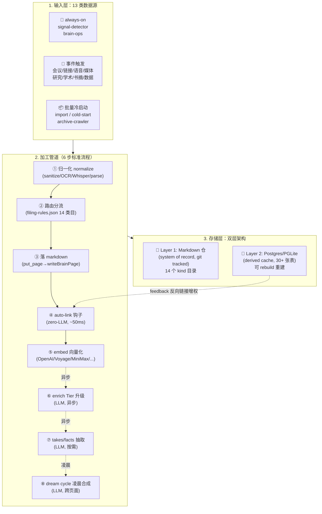

# GBrain 数据生命周期全景

> 主人改造前必须吃透的最底层：**13 类数据怎么进来 → 经过哪些加工 → 落到哪里**。
>
> 不看这个，谈"借鉴 gbrain"都是浮于表面。

---

## 0. 🎯 一图总览



---

## 1. 📥 输入层：13 类数据接入渠道

按"喂入模式"分**三档**：

### 1.1 🔄 实时流式（always-on，2 个）

| Skill | 干啥 | 触发频率 | LLM |
|---|---|---|---|
| **signal-detector** | 每条入站消息双线捕获：原创思想 + 实体提及 | 每条消息（不阻塞主响应） | ✓ 廉价 Haiku |
| **brain-ops** | 读→丰富→写循环（每次响应前先查脑） | 每条消息 | ✓ |

**关键**：这两个**spawn 在 cheap sub-agent 并行**，不阻塞主响应。**主人若用 Opus 跑 always-on 一天烧 100 刀**——必须 Haiku/Sonnet 级。

---

### 1.2 📨 事件触发（用户/外部触发，8 个）

每个事件触发对应一个专门的 ingest skill。这是 gbrain 数据**最丰富的喂入路径**。

| Skill | 输入数据 | 关键加工动作 | 落到目录 |
|---|---|---|---|
| **meeting-ingestion** | 会议转录 (Granola/Otter/Circleback/Fathom) | ❗ 每个 attendee 必走 enrich | `meetings/` + `people/` + `companies/` |
| **idea-ingest** | 链接 / 文章 / 推文 / "save this" | fetch URL → analyze → 作者画像 | `media/articles/` + `people/` |
| **voice-note-ingest** | 语音备忘录 (Twilio 接电话 + Whisper) | ⭐ **原话保真**决策树路由 | `originals/` 或 `concepts/` 或 `people/` 或 `voice-notes/` |
| **media-ingest** | 视频 / 音频 / PDF / 书 / 截图 / GitHub repo | 转录 / OCR / 子代理 fan-out | `media/<type>/` |
| **article-enrichment** | 原始文本墙（raw 文章 dump） | 提炼 executive summary + verbatim quotes + insights + why-it-matters | 同 `media/articles/` |
| **perplexity-research** | 主题关键词 + brain 上下文 | ⭐ 对照 brain 找"新 vs 已知" → 8 段结构化输出 | `analysis/` 或 `companies/<slug>/` |
| **data-research** | YAML recipe + 数据源 | 结构化追踪（投资人/捐赠/公司指标） | `companies/` + `tracker pages` |
| **academic-verify** | 学术引用 / 研究 claim | publication → method → raw data → replication 链 | `concepts/` 或 `civic/` |
| **book-mirror** | EPUB / PDF 一本书 | ⭐ fan-out N 个只读子代理（每章一个）→ 双栏 personalized 分析 | `media/books/` |
| **strategic-reading** | 书 + 主人特定问题 | 透镜阅读 → 短/中/长期 playbook | `concepts/` |
| **webhook-transforms** | SMS / 社交 mention / 任意外部事件 | 转换 schema + sanitize → put_page | 按事件类型 |
| **daily-task-manager / -prep** | 用户任务 / 日程 | 任务生命周期 + 晨间准备 | `daily/` + tasks 表 |

---

### 1.3 📦 批量冷启动（一次性灌入，3 个）

| Skill | 数据源 | 时长 | 产出页数 |
|---|---|---|---|
| **`gbrain import <dir>`** | 现有 markdown / 代码仓 | 5-10 分钟 | 100s-1000s |
| **cold-start** skill | 按"信息密度 × 易导入"9 步排序灌 | 1-2 小时 | 1K-3K |
| **archive-crawler** skill | Dropbox / Backblaze / Gmail-Takeout / 硬盘老归档（必须 allow-list） | 数小时-数天 | 视数据量 |
| **migrate** skill | Obsidian / Notion / Logseq / Roam 通用迁移 | 视数据量 | 视数据量 |

**Garry 冷启动优先级（cold-start skill 实际表格）**：

```
P1 现有 markdown/Obsidian     5 min   100-1000s pages（密度最高）
P2 Google Contacts            10 min  50-500（seed 人物目录）
P3 Google Calendar (90 天)    15 min  30-90（会议历史）
P4 Gmail (recent threads)     20 min  50-200（关系上下文 + 组织图谱）
P5 ChatGPT/Claude 对话导出    15 min  10-100（思维过程）
P6+ Twitter archive, Slack, 文件归档
```

---

## 2. ⚙️ 加工管道：put_page 之后的 8 步标准流程

**核心铁律**：无论数据从哪 13 个渠道进来，**最终都走同一个接口 `put_page(slug, body, frontmatter)`**，触发统一的加工流水线。

参见 `src/core/brain-writer.ts` 的三个核心 export：
- `autoFixFrontmatter()` — 写入前自动修复 YAML 头
- `writeBrainPage()` — 真正的物理写入
- `scanBrainSources()` — 批量扫描入口

### 加工 8 步流水线

#### ① 归一化（normalize）— 输入 sanitize

不同输入源走不同 normalize 路径：

| 输入 | normalize 工具 | 输出 |
|---|---|---|
| 网页/文章 URL | `web_fetch` → markdown | 干净 markdown |
| PDF | `pdftotext` / `pypdf` | 文本流 |
| 视频/音频 | Whisper API | 转录文本 |
| 截图 | OCR（Tesseract / GPT-4o vision） | 文本 |
| Webhook payload | schema 翻译 + 转 markdown + **strip HTML/script** | 安全 markdown |
| 邮件 | mbox / IMAP → markdown + 元数据 | 含 [Source] 引用 |
| EPUB | epub → chapter markdown 数组 | 章节流 |

⚠️ **gbrain 默认 sanitization 铁律**：
- 必须 strip HTML 标签
- 必须 escape script 内容
- 失败时 raw payload 进 `_dead-letter/{timestamp}.md`（不丢数据）

---

#### ② 路由分流（按 `_brain-filing-rules.json`）

gbrain 用一份机器可读的 JSON 决定"这条数据该归到哪个目录"。**14 个 kind 类目**：

| kind | 目录 | 典型例子 |
|---|---|---|
| **person** | `people/` | 创始人 / 投资人 / 与会人 / 联系人 |
| **company** | `companies/` | portfolio 公司 / 收购方 / 供应商 |
| **deal** | `deals/` | 种子轮 / 并购交易 |
| **meeting** | `meetings/` | 1:1 / pitch / pod |
| **concept** | `concepts/` | 心智模型 / 论点 / 框架 |
| **project** | `projects/` | 内部 initiative / 跨会话工作 |
| **analysis** | `analysis/` | 深度分析 / 对比研究 |
| **civic** | `civic/` | 政策分析 / 政府话题 |
| **writing** | `writing/` | 主人撰写的文章 / 草稿 / 已发表稿 |
| **guide** | `guides/` | runbook / how-to |
| **tech** | `tech/` | API / 库 / 语言笔记 |
| **finance** | `finance/` | 市场数据 / 指标 |
| **personal** | `personal/` | 私人生活 / 健康 |
| **originals** | `originals/` ⭐ | 主人**原创思想**（reflections / new takes） |

**铁律：page kind 由"主要主题"决定，不是格式决定**（参见 `repo-architecture` skill）。例如一段会议讨论了某概念——主体是会议 → 进 `meetings/`，不进 `concepts/`。

---

#### ③ 落 markdown（put_page → writeBrainPage）

真正的物理写入。三件事：

1. **slug 解析 + 消歧**——pg_trgm 模糊匹配，决定是新建还是更新已有页
2. **写文件**——markdown 内容写到对应 `<kind>/<slug>.md`
3. **frontmatter 强制保鲜**——`last_updated` / `decay_speed` / `access_count` / `tags` / `relations` 自动维护

写入的 markdown 结构（典型 page）：

```markdown
---
slug: people/sam-altman
last_updated: 2026-05-12
decay_speed: slow
access_count: 47
tags: [openai, yc, ai-leader]
relations:
  founded: [openai]
  invested_in: [helion, retro-bio]
  attended: [yc-summer-2005]
---

# Sam Altman

## Compiled Truth ⭐ （冷凝信念，事实层）
- CEO OpenAI since 2019
- Former YC President 2014-2019
- ...

## Timeline ⭐ （时间线，事件流）
- 2026-04-12: 主人在 Bob 推荐链接里看到 → ...
- 2026-03-08: meeting/yc-demo-day-2026 出场
- ...

## Takes ⭐ （多 holder 信念，v0.28+）
- holder=brain weight=0.9 "Sam 比 Elon 更适合做 OpenAI"
- holder=people/paul-graham weight=0.85 "Sam 是我见过最有 founder DNA 的"
- ...
```

**关键架构**：**Compiled Truth + Timeline 双层结构**——冷凝的事实 + 流动的事件。

---

#### ④ auto-link 钩子（zero-LLM，~50ms）

put_page 触发的自动连线——**这是 gbrain 最神奇的工程巧思**。**完全不调 LLM**：

```python
# 伪代码（实际 TS 在 brain-writer.ts）
def on_put_page(page):
    candidates = []
    # 路径 1：markdown 正文
    candidates += WIKILINK_RE.findall(page.body)           # [[people/sam-altman]]
    candidates += ENTITY_REF_RE.findall(page.body)         # [Sam Altman](people/sam-altman)

    # 路径 2：frontmatter map（11 条静态规则）
    for field, link_type, direction in FRONTMATTER_LINK_MAP:
        candidates += build_edges(page.frontmatter, field, link_type, direction)

    # link_type 推断（4 条 verb 正则在 240 字符上下文里跑）
    for c in candidates:
        c.link_type = infer_link_type(context_window(c, 240))

    upsert_links_table(candidates)
    propagate_backlinks(candidates)  # 写到对方页的 Timeline section
```

**精度实测**：70-94%（不调用 LLM 的情况下）

---

#### ⑤ embed 向量化

每个 page 写完后，content_chunks 表的对应 chunk 进 **embed queue**：

| 维度 | 配置 |
|---|---|
| 默认 provider | OpenAI `text-embedding-3-small`（1536 维） |
| 可选 | Voyage / Gemini / MiniMax / DashScope / Zhipu / Ollama / llama-server / LiteLLM 等 **14 种** |
| 索引 | HNSW（pgvector） |
| 批处理 | 每批 ≤4096 tokens（MiniMax）或 ≤8192（OpenAI） |
| 延迟 | 异步队列，不阻塞写入 |

**stale embed 模式**：dream cycle 凌晨 `embed --stale` 批量补全缺失的 embedding（昨天新增的 facts/takes）。

---

#### ⑥ enrich Tier 升级（按需 LLM）

实体（person/company）写入后**不**立刻深度画像。先看"提及频次"决定 Tier：

```
首次提及 → Tier 3 stub（仅 cross-ref）
  ↓ 多次互动累积
Tier 2 notable → web research + social
  ↓ 核心圈/合作者升级
Tier 1 key → 全管线（含深度研究 + 引用追溯）
```

**Tier 升级触发的 enrich 7 步协议**：
1. brain-first search（先查已有）
2. perplexity-research（对照已知找新）
3. structured data extraction
4. timeline merge
5. compiled_truth 重新冷凝
6. takes/facts 抽取
7. 反向链接传播

成本节省：Tier 3 stub **几乎不调 LLM**，Tier 1 才走全套。

---

#### ⑦ takes / facts 抽取（LLM，按需）

**takes**（多 holder 冷信念）和 **facts**（主人热记忆）是 gbrain v0.28+ 的认知层（参见 `03_数据与交互视角.md` §C）：

| | takes（冷信念） | facts（热记忆） |
|---|---|---|
| 触发 | 页面 markdown `## Takes` fence 块写入 | 实时对话每轮 turn |
| 模型 | Sonnet（页面级批处理） | Sonnet/Haiku（每轮 turn） |
| 持久化 | takes 表（含 holder + weight + HNSW） | facts 表（active local index） |

---

#### ⑧ dream cycle 凌晨合成（LLM，跨页面，异步）

每日凌晨 2 点（cron `0 2 * * * gbrain dream`），跑 **8 阶段 phase**：

```
1. lint --fix              （fs frontmatter 修复）
2. backlinks --fix         （反向链接铁律补全）
3. sync                    （DB 写入：pages/chunks/links）
4. synthesize ⭐           （新页：reflections + originals）
5. extract                 （重抽 links + timeline）
6. patterns ⭐⭐           （跨 ≥3 reflections 找纵向主题 → patterns/）
7. embed --stale           （chunks/takes embedding 补全）
8. orphans + purge         （清理孤儿页 + 硬删 72h 过期）
```

**关键工程巧思**：
- ⚡ **两层模型降本**：Haiku 廉价过滤"值不值深度处理" → Sonnet 深度合成
- 🔒 **沙箱写入**：`allowed_slug_prefixes` allow-list 强制（即使 prompt injection 也写不出指定目录）
- 🛡️ **隐私正则**：`exclude_patterns: ["medical", "therapy"]` 在 LLM 调用**之前**过滤
- 💾 **幂等键**：`(file_path, content_hash)` 缓存，编辑后转录生成新 slug 而不覆盖
- ❄️ **冷却**：`cooldown_hours: 12`，autopilot 每天最多 2 次合成

---

## 3. 💾 存储层：双层架构

### 3.1 ⭐ Layer 1：Markdown 仓（system of record）

**铁律：markdown 是真相，DB 是 derived cache。DB 出问题 `gbrain rebuild --confirm-destructive` 一键重建**。

#### Markdown 目录树（14 个 kind 顶级目录）

```
~/.gbrain/repo/
├── people/                  ⭐ 人物画像（compiled_truth + timeline + takes）
├── companies/               ⭐ 公司画像
├── deals/                   交易档案
├── meetings/                会议记录
├── concepts/                心智模型 / 框架
├── projects/                跨会话工作
├── analysis/                深度分析
├── civic/                   政策 / 政府
├── writing/                 主人撰写的文章
├── guides/                  runbook / how-to
├── tech/                    技术参考
├── finance/                 市场数据
├── personal/                私人 / 健康
├── originals/ ⭐            主人原创思想（reflections）
│   └── reflections/
├── patterns/ ⭐             dream cycle 跨主题模式
├── media/                   多模态资料
│   ├── articles/
│   ├── books/
│   ├── videos/
│   ├── podcasts/
│   └── screenshots/
├── daily/                   日常 / 任务
├── voice-notes/             ⭐ 原话保真语音备忘
├── conversations/           ChatGPT/Claude 对话存档
├── dream-cycle-summaries/   每日凌晨自进化产出索引
└── _dead-letter/            ⚠️ webhook 失败的原始 payload
```

#### `db_tracked` vs `db_only` 分流（核心架构）

**核心知识（人工产出 / 高价值）→ db_tracked**：
- 进 git，可读可备份
- 例：people/ / companies/ / concepts/ / originals/

**机器生成（自动转录 / 高频）→ db_only**：
- 不进 git，只入 DB，避免污染版本历史
- 例：meetings/transcripts/ / conversations/raw/ / 原始邮件转换

⚠️ **关键**：dream cycle 的 synthesize 阶段把 db_only 的 transcripts **蒸馏**进 db_tracked 的 originals/reflections —— **从噪音到信号的精炼**。

---

### 3.2 💾 Layer 2：Postgres / PGLite 派生 cache

**完整 30+ 表清单**（schema.sql 真实抠出来），按职能分 7 组：

#### Group A：核心内容索引（4 张）
| 表 | 作用 |
|---|---|
| **sources** | 多仓 / 多 brain 租户区分 |
| **pages** | 核心内容表（含 compiled_truth + timeline 解析后字段） |
| **content_chunks** | 向量索引层（HNSW + cosine） |
| **page_versions** | 版本历史 |

#### Group B：关系图谱（3 张）
| 表 | 作用 |
|---|---|
| **links** ⭐ | 类型化边（attended/works_at/invested_in/founded/advises/mentions...） |
| **tags** | 标签索引 |
| **timeline_entries** | 时间线条目（page Timeline section 解析后入库） |

#### Group C：代码图谱（2 张，仅当用 gbrain code 时启用）
| 表 | 作用 |
|---|---|
| **code_edges_chunk** | 代码块级别的调用边 |
| **code_edges_symbol** | 符号级别的调用边 |

#### Group D：认知层（4 张）— v0.28+
| 表 | 作用 |
|---|---|
| **takes** ⭐ | 多 holder 冷信念（含 holder + weight + HNSW active only） |
| **facts** ⭐ | 主人热记忆（含 kind: preference/commitment/event/belief/fact） |
| **raw_data** | 结构化数据（data-research skill 产出） |
| **synthesis_evidence** | 引用追溯（synthesize → take 的证据链） |

#### Group E：作业调度（5 张）— Minions
| 表 | 作用 |
|---|---|
| **minion_jobs** | 任务队列（durable Postgres-native） |
| **minion_inbox** | 父子任务通信箱 |
| **minion_attachments** | 任务附件 |
| **subagent_messages** | 子代理对话持久化（crash-resumable） |
| **subagent_tool_executions** | 子代理工具调用持久化（两阶段 ledger） |

#### Group F：访问 / 权限（5 张）
| 表 | 作用 |
|---|---|
| **access_tokens** | 旧式 bearer token |
| **oauth_clients / tokens / codes** | OAuth 2.1 三件套 |
| **mcp_request_log** | MCP 请求审计 |

#### Group G：自进化 / 评测（5 张）
| 表 | 作用 |
|---|---|
| **dream_verdicts** | dream cycle 增量缓存（content_hash → 上次判定） |
| **gbrain_cycle_locks** | 凌晨任务并发控制 |
| **eval_candidates** | 真实查询脱敏回采（BrainBench-Real） |
| **eval_capture_failures** | 评测捕获失败日志 |
| **eval_takes_quality_runs** | takes 抽取质量评测 |

#### Group H：摄入 / 文件（4 张）
| 表 | 作用 |
|---|---|
| **ingest_log** | 摄入历史（断点续传依据） |
| **files** | 文件二进制（小附件） |
| **file_migration_ledger** | 文件迁移账本 |
| **subagent_rate_leases** | 子代理速率限制租约 |

#### Group I：配置（1 张）
| **config** | 全局 key-value 配置 |

---

## 4. 🔄 数据类型 × 加工路径全景矩阵

下面这张表是**主人改造时最该打印贴墙的参考**——一眼看清"什么数据进来 → 走什么 skill → 落到哪儿"：

| 数据类型 | 接入 skill | 关键加工动作 | 落 markdown 目录 | 落 DB 表 |
|---|---|---|---|---|
| 用户对话 | signal-detector + brain-ops | 双线捕获 + 实体提取 | `originals/` + `daily/` | pages + chunks + links + facts |
| 会议转录 | meeting-ingestion | 每个 attendee enrich | `meetings/` + 同步 `people/` `companies/` | 同上 + timeline_entries |
| 链接 / 文章 | idea-ingest | fetch → analyze → 作者画像 | `media/articles/` + `people/` | 同上 |
| 推文 | idea-ingest | 同上 + tweet author 画像 | 同上 | 同上 |
| 语音备忘 | voice-note-ingest | Whisper → 原话保真路由 | 7 个候选目录之一 | 同上 |
| PDF | media-ingest | pdftotext + entity 抽 | `media/articles/` | 同上 |
| 书 | book-mirror | fan-out N 子代理 → 双栏 | `media/books/` | pages |
| 视频 | media-ingest | Whisper → entity 抽 | `media/videos/` | 同上 |
| 截图 | media-ingest | OCR → entity 抽 | `media/screenshots/` | 同上 |
| GitHub repo | media-ingest | clone + 代码图谱抽取 | `tech/` | code_edges_* |
| 邮件 | webhook + idea-ingest | mbox → markdown + sanitize | `media/articles/` | 同上 |
| 网络研究 | perplexity-research | 对照 brain 找新 | `analysis/` | 同上 |
| 学术引用 | academic-verify | 4 阶段验证链 | `concepts/` | 同上 |
| 数据追踪 | data-research | YAML recipe 提取 | `companies/<slug>/` + tracker | raw_data + 同上 |
| 任务 | daily-task-manager | task lifecycle | `daily/tasks/` | pages |
| 报告 | reports | 时间戳路由 | `daily/reports/` | pages |
| 老归档 | archive-crawler | allow-list 扫 + filter | 按 filing-rules 分流 | 同上 |
| 现有 markdown 仓 | `gbrain import` | 批量扫 + auto-link | 不动原结构 | chunks + links + facts |
| SMS / 社交 mention | webhook-transforms | sanitize + 转 markdown | 按事件类型 | 同上 |

**注**：所有路径最终都进 `pages + content_chunks + links` **三件套核心表**。这就是 gbrain 架构的统一性。

---

## 5. 🌊 全景数据流图（标准生命周期）

```mermaid
sequenceDiagram
    autonumber
    participant Src as 外部数据源<br/>(meeting/email/voice/web)
    participant Skill as ingest skill<br/>(13 选 1)
    participant Norm as normalize<br/>(sanitize/OCR/Whisper)
    participant Filing as filing-rules<br/>(14 类目路由)
    participant PP as put_page<br/>(brain-writer)
    participant FS as markdown 仓<br/>(system of record)
    participant Link as auto-link<br/>(zero-LLM, ~50ms)
    participant Emb as embed queue<br/>(异步)
    participant DB as Postgres/PGLite<br/>(derived cache)
    participant Enr as enrich<br/>(Tier 升级, 按需)
    participant Dream as dream cycle<br/>(凌晨, 跨页面)

    Src->>Skill: 触发 ingest
    Skill->>Norm: 原始数据
    Norm->>Filing: 干净 markdown
    Filing->>PP: 判定 kind + slug
    PP->>FS: 写 <kind>/<slug>.md
    PP->>Link: 触发钩子
    Link->>DB: UPSERT links 表
    Link->>FS: 回链对方页 Timeline
    PP->>Emb: 加入向量队列
    Emb-->>DB: 写 content_chunks
    PP->>DB: 写 pages + tags + ingest_log

    Note over Enr: 异步：Tier 升级触发
    DB->>Enr: 实体提及计数 >= 阈值
    Enr->>Skill: 调 perplexity-research / web
    Enr->>PP: 写回 enriched page

    Note over Dream: 凌晨 2:00 cron
    Dream->>FS: lint + backlinks fix
    Dream->>DB: sync 索引
    Dream->>FS: synthesize 新 reflections
    Dream->>FS: patterns 跨主题合成
    Dream->>DB: consolidate facts→takes
    Dream->>DB: embed --stale 补全
```

---

## 6. 🎯 对主人新方向的启示

经过这次全景梳理，主人应当看到：**数据生命周期是 gbrain 最深的工程功夫所在**。

### 6.1 🟢 主人现有知识库已对接的环节

| 环节 | 主人当前实现 | 备注 |
|---|---|---|
| 路由分流 | ✅ 实体模板 + frontmatter relations | 类似 filing-rules，但只有 4 类（人物/公司/概念/洞察） |
| 写 markdown | ✅ 主人/Agent 手动 | 走 ingest.js + 模板套用 |
| frontmatter 维护 | ✅ last_updated / decay_speed / access_count / relations | 主人已对接 |
| embed | ✅ qmd embed | 单引擎 |
| 维护 | ✅ 月度折旧巡检 | 被动减负 |

### 6.2 🔴 主人现在缺失的环节（改造重点）

| 缺失环节 | gbrain 怎么做 | 主人应该怎么做 |
|---|---|---|
| ❌ **normalize 层** | 不同 skill 不同管道（Whisper / OCR / fetch） | v0.2 起步：仅对 markdown / PDF 做 normalize |
| ❌ **auto-link 钩子** | put_page 自动触发 zero-LLM 提取 | **B.1 改造的核心** — 写 `qmd autolink` 子命令 |
| ❌ **Tier 升级** | enrich 7 步协议 + 提及计数驱动 | v0.2 起步：仅做 Tier 3/2 区分（手动标 flag） |
| ❌ **takes/facts 二分** | v0.28+ 多 holder + HNSW | 主人 `insights/` 已有"主人引用别人观点"——但混在一起。**v0.2 拆出 takes/** |
| ❌ **dream cycle** | 8 phase 凌晨 cron | **B.3 改造的核心** — 起步 consolidate + embed --stale 两 phase |
| ❌ **db_tracked / db_only 分流** | dream cycle synthesize 把噪音蒸馏成信号 | 主人现在所有都在 git——加 `raw/` 目录 db_only |
| ❌ **eval_candidates 真实查询回采** | 默认 OFF，CONTRIBUTOR_MODE 开 | v0.1 直接加（最低 ROI 最高） |

### 6.3 ⭐ 主人最该立刻抄的"最低 ROI 最高"组合

按主人当前 320 实体规模 + 个人/小团队用 + Python 系，奴婢推荐**优先抄这 4 招**：

```
🥇 1. auto-link 钩子（zero-LLM）— B.1
    成本：~1-2 天 Python，零 LLM 调用
    收益：主人维护负担降一个数量级

🥈 2. db_only / db_tracked 分流
    成本：调整目录 + .gitignore
    收益：原始对话日志不污染 git，体积可控

🥉 3. eval_candidates 真实查询回采
    成本：~半天 Python（sqlite 表 + 拦截 qmd 调用）
    收益：未来改造可量化（"改了之后召回有没有变差"）

🏅 4. dream cycle consolidate + embed --stale（两 phase）— B.3
    成本：~3-5 天（含 prompt 调优）
    收益：被动减负 → 主动巩固，知识库自己变聪明
```

### 6.4 ⚠️ 不要立刻抄的环节

🔴 **enrich 7 步协议**——太重，主人 320 实体里大多是冷实体，不需要 perplexity-research + structured extraction 这种重型管线

🔴 **完整 14 类目 filing-rules**——主人目前 4 类够用，扩到 14 类是过度设计

🔴 **Minions 子代理调度**——主人单机 Python 加 asyncio / Celery 即可，不需要 Postgres-native queue

🔴 **完整 30+ 表**——主人 v0.1 只需要 `pages + chunks + links + facts` 四张表（参见 `03_数据与交互视角.md` §G.1）

---

## 7. 📋 一页纸总结（贴墙版）

```
┌─────────────────────────────────────────────────────────────────────┐
│ GBrain 数据生命周期 = 13 输入 × 8 加工 × 双层存储                    │
├─────────────────────────────────────────────────────────────────────┤
│                                                                       │
│  输入（13 类）        加工（8 步）         存储（2 层）                │
│  ─────────────       ──────────────       ──────────────             │
│  always-on 2        ① normalize          📁 markdown 14 目录          │
│    └ signal-detector ② 路由 filing       💾 Postgres 30+ 表           │
│    └ brain-ops      ③ put_page                                       │
│                     ④ auto-link 钩子                                  │
│  事件 8             ⑤ embed              system of record (md)        │
│    └ meeting/idea/  ⑥ enrich tier        + derived cache (db)        │
│    └ voice/media/   ⑦ takes/facts        rebuild 可重建               │
│    └ article/data/  ⑧ dream cycle                                    │
│    └ academic/book                       压舱石：put_page 一个接口    │
│                                                                       │
│  批量 3                                  神奇之处：auto-link 零 LLM   │
│    └ import         全部走 put_page                                  │
│    └ cold-start     不论从哪进 → 同一个                              │
│    └ archive-crawler  加工流水线 → 同一种                            │
│                       存储格式                                       │
│                                                                       │
└─────────────────────────────────────────────────────────────────────┘
```

---

*分析依据：gbrain master 分支 `src/core/brain-writer.ts` + `src/schema.sql` 922 行 + `skills/_brain-filing-rules.json` + 13 个 ingest skill 的 SKILL.md + cold-start / archive-crawler / webhook-transforms 三个批量入口的 SKILL.md。所有数字和字段都可回溯到具体源码行。*
